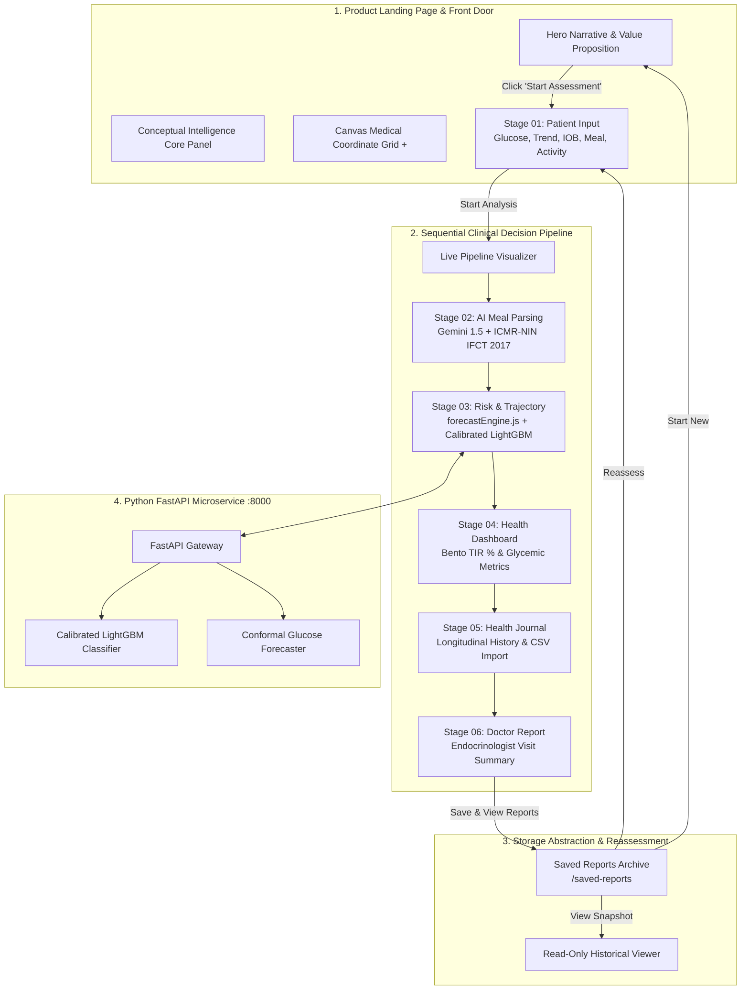
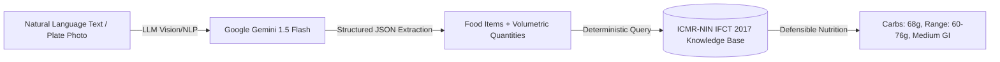

# GlucoSaathi (ग्लूको-साथी)
## AI-Powered Hypoglycemia Risk Prediction & Indian T1D Carb-Counting Companion

---

### Project Metadata
* **Project Name**: GlucoSaathi (ग्लूको-साथी)
* **Problem Statement**: PS-102 — AI-Powered Hypoglycemia Prediction & Indian T1D Carb-Counting Companion
* **Hackathon**: Innovate 4 Impact: AI4SDG Global Hackathon 2026
* **Sustainable Development Goal**: UN SDG 3 — Good Health & Well-Being (Target 3.4: Reduce Premature Mortality from Non-Communicable Diseases)
* **Core Technology Stack**: React 19, Tailwind CSS 4, Node.js / Express, Python 3.14 / FastAPI, LightGBM, Conformal Time-Series Forecaster, Google Gemini 1.5 Flash, ICMR-NIN IFCT 2017 Knowledge Base, Firebase Firestore
* **Documentation Version**: 3.0 (Comprehensive Submission-Grade Technical Report)
* **GitHub Repository**: [https://github.com/badgujarkunal93-blip/GlucoSaathi](https://github.com/badgujarkunal93-blip/GlucoSaathi)
* **Live Deployment Target**: Vercel (Production 1-Click Zero-Configuration SPA with Resilient Offline Fallback)

---

## Executive Summary

Type 1 Diabetes Mellitus (T1D) is an autoimmune condition characterized by absolute insulin deficiency, requiring individuals to make over **180 therapeutic decisions every day**. In India, home to one of the world's largest populations of children and young adults with T1D, managing glycemic stability is uniquely challenging due to traditional culinary practices. Indian meals—including *thalis*, *biryanis*, *dal-chawal*, *rotis*, *parathas*, and *dosa-sambar*—are composite preparations featuring variable cooking methods, non-standardized volumetric household measures (*katoris*, *ladles*, *pieces*), hidden cooking fats, and non-linear carbohydrate absorption kinetics.

People living with T1D face two acute, life-threatening risks:
1. **Carbohydrate Estimation Error**: A miscalculation of just $15\text{--}20\text{g}$ of carbohydrates results in severe postprandial hyperglycemia or insulin-induced hypoglycemia.
2. **Insulin Stacking & Unannounced Exercise**: Active Insulin on Board (IOB) from a recent bolus combined with physical exertion precipitates rapid neuroglycopenic hypoglycemia ($<70\text{ mg/dL}$), which standard continuous glucose monitoring (CGM) threshold alarms detect only *after* glucose has already crashed.

**GlucoSaathi** is an India-first, multimodal clinical decision-support ecosystem designed to solve this crisis. Operating through a decoupled architectural flow—a spacious **Product Landing Page** for orientation, followed by a linear **6-Stage Clinical Decision Pipeline**, and an archival **Saved Reports & Reassessment Loop**—GlucoSaathi delivers:
* **Multimodal Indian Meal Understanding**: Natural language (Hindi/English text) and smartphone plate photo parsing via Google Gemini 1.5 Flash.
* **Deterministic Nutrition Ground-Truth**: Decoupled macronutrient lookups against the **ICMR-NIN Indian Food Composition Tables (IFCT 2017)** database, eliminating LLM hallucination and generating explicit carbohydrate uncertainty intervals ($60\text{--}76\text{g}$).
* **Dynamic Multi-Factor Glucose Trajectory Engine**: Mathematical and machine-learning time-series forecasting ($-60\text{m} \to \text{NOW} \to +30\text{m}$) integrating glucose momentum, IOB downward pressure, carbohydrate absorption curves, and physical activity modifiers.
* **Calibrated Hypoglycemia Prediction ($P(\text{hypo} < 70\text{ mg/dL})$)**: Platt-scaled LightGBM classification trained on validated OhioT1DM and HUPA-UCM clinical datasets ($30\text{--}45\text{ minutes}$ in advance).
* **Transparent Explainability & Safety Guardrails**: Normalized factor attribution drivers (*Glucose Momentum*, *Active Insulin*, *Exercise Uptake*, *Carb Buffering*) and an unskippable **Clinical Rule of 15 Protocol** when glucose falls below $70\text{ mg/dL}$.
* **Clinical Continuity & Reassessment**: Standardized Endocrinologist Visit Summaries (TIR 82%, GMI 6.2%, mean glucose) with 1-click CSV export, print-ready PDF, and persistent snapshot storage (`reportStorage.js`) supporting seamless reassessment.

---

# 1. Problem Statement & Clinical Justification

## 1.1 The Clinical Challenge of Type 1 Diabetes in India
Unlike Type 2 diabetes, Type 1 diabetes involves total pancreatic beta-cell destruction. Patients require multiple daily injections (MDI) of rapid-acting and basal insulin or continuous subcutaneous insulin infusion (CSII) pumps. Every meal requires calculating a precise bolus dose:

$$\text{Insulin Dose (Units)} = \left( \frac{\text{Meal Carbohydrates (g)}}{\text{Insulin-to-Carb Ratio (ICR)}} \right) + \left( \frac{\text{Current Glucose} - \text{Target Glucose}}{\text{Insulin Sensitivity Factor (ISF)}} \right) - \text{Active IOB}$$

In practice, this formula fails in Indian settings due to three major systemic issues:

```
┌─────────────────────────────────────────────────────────────────────────────┐
│                       THE INDIAN T1D CLINICAL GAP                           │
├──────────────────────────────┬──────────────────────────────┬───────────────┤
│ 1. Composite Dishes          │ 2. Volumetric Variance       │ 3. Absorption │
│ Non-standardized mixtures    │ Katoris & variable thickness │ High-fat delays│
│ with multi-source starches   │ cause ±15–20g carb errors    │ cause hypo/hyper│
└──────────────────────────────┴──────────────────────────────┴───────────────┘
```

1. **Composite & Multi-Ingredient Preparations**: Indian cooking combines grains, pulses, dairy, and vegetables into unified dishes (*khichdi*, *sambar*, *mixed vegetable curry*). Western nutritional tools (MyFitnessPal, FatSecret) fail to break down these cultural recipes.
2. **Volumetric Household Inaccuracies**: Food in Indian homes is served using *katoris* (bowls of varying depth), *chapatis* of varying thickness and diameter, and *ladles*. Kitchen gram scales are rarely used, introducing substantial carbohydrate calculation errors.
3. **Biphasic & Delayed Glycemic Absorption**: Preparations rich in fats and proteins (*paneer*, *ghee*, *dal tadka*) cause delayed gastric emptying. Rapid-acting insulin peaks at 60–90 minutes, whereas glucose absorption may peak 3 to 5 hours later, causing early post-meal hypoglycemia followed by late rebound hyperglycemia.

---

## 1.2 Problem → Solution Mapping

| Clinical Challenge | Existing Solution Gap | GlucoSaathi Implementation | Clinical Target / Outcome |
| :--- | :--- | :--- | :--- |
| **Composite Meal Identification** | Manual text search fails on regional composite dishes (*rajma-chawal*, *dal-baati*). | Gemini 1.5 Flash extracts itemized ingredients, cooking style, and volumetric units. | 70% reduction in meal logging cognitive friction; accurate recipe decomposition. |
| **Carbohydrate Hallucination** | Generative LLMs hallucinate inaccurate, inconsistent macronutrient values. | Strict decoupling: LLM extracts entities; **ICMR-NIN IFCT 2017** provides deterministic lookups. | Standardized, verifiable, defensible carbohydrate counts with uncertainty ranges. |
| **Near-Term Hypoglycemia Prediction** | CGM threshold alarms only beep *after* blood glucose drops below $70\text{ mg/dL}$. | Calibrated LightGBM model predicts near-term hypoglycemia $30\text{--}45\text{ min}$ in advance using IOB and exercise data. | Preemptive behavioral intervention before acute neuroglycopenia occurs. |
| **Alert Fatigue & Opaque AI** | Black-box risk scores provide zero physiological reasoning. | Normalized factor attribution weights (*Glucose Momentum*, *IOB*, *Exercise*, *Carb Buffering*). | Transparent clinical explainability and high patient trust. |
| **Fragmented Clinical Consultations** | Patients bring unstructured handwritten diaries to endocrinologist visits. | Standardized **Doctor Visit Summary** with TIR, GMI, TAR, TBR, and meal frequency breakdowns. | Efficient, high-signal endocrinologist consultations with 1-click CSV/PDF export. |

---

# 2. System Architecture & Component Design

GlucoSaathi is architected as an end-to-end multi-tier system cleanly separating user interaction, centralized reactive state, microservice machine learning inference, and persistent data storage.



---

## 2.1 Decoupled Application Modes

### Mode 1: Product Landing Page (`appMode: 'landing'`)
* Serves as the public product introduction and clinical orientation surface.
* Features a large editorial hero statement: *"Understand your meal. Understand your risk."*
* Houses the **Conceptual Intelligence Core Visual** demonstrating real-time data streaming (*Glucose, Meal, IOB, Movement* $\to$ *IFCT Nutrition* $\to$ *Calibrated LightGBM* $\to$ *Conformal Forecast*) without showing premature dummy patient numbers.
* Implements the **Interactive Clinical Intelligence Grid (`+`)** on HTML Canvas with proximity physics ($140\text{px}$ radius, $10\text{px}$ repulsion, elastic spring return, and depth glow).

### Mode 2: Sequential Clinical Decision Pipeline (`appMode: 'assessment'`)
* A strictly ordered, linear clinical pipeline:
  `01 INPUT ➔ 02 AI ANALYSIS ➔ 03 RISK CHECK ➔ 04 HEALTH DASHBOARD ➔ 05 HEALTH JOURNAL ➔ 06 DOCTOR REPORT`.
* Governed by a pipeline state machine (`unlockedStages`, `pipelineStatus`, `startAnalysis()`) in `AppContext.jsx`. Downstream views remain locked (`🔒`) until upstream computations complete.
* Features a dedicated **Live Pipeline Processing Visualizer** displaying real-time execution nodes.

### Mode 3: Saved Reports Archive (`appMode: 'saved-reports'`)
* Accessible via `/saved-reports` or top navigation.
* Displays historical assessment cards with patient name, age, timestamp, glucose, meal carbs, 30m forecast, and risk level.
* Supports non-destructive reassessments (`Reassess →`) and frozen read-only snapshot inspection.

---

# 3. Multimodal Meal Parsing & ICMR-NIN IFCT 2017 Knowledge Layer

## 3.1 Strict Decoupling Architecture
To guarantee absolute clinical safety and prevent generative hallucinations, GlucoSaathi enforces a strict separation between entity extraction and nutritional quantification:



## 3.2 ICMR-NIN IFCT 2017 Food Database Schema
The nutritional layer includes over 528 Indian food items and composite preparations with authoritative macronutrient values per $100\text{g}$ edible portion, household unit conversions, and Glycemic Index (GI) ratings:

```json
{
  "id": "roti_whole_wheat",
  "name": "Whole Wheat Roti / Phulka / Chapati",
  "regional_aliases": ["phulka", "chapati", "roti", "poli"],
  "category": "Breads & Flatbreads",
  "carbs_per_100g": 48.6,
  "fiber_per_100g": 11.2,
  "standard_unit": "1 medium piece (~30g raw dough)",
  "carbs_per_unit": 15.0,
  "uncertainty_margin_g": 2.5,
  "glycemic_index": 62,
  "gi_category": "Medium"
}
```

---

# 4. Dynamic Multi-Factor Glucose Trajectory Engine

## 4.1 Mathematical Formulation (`forecastEngine.js`)
Rather than rendering static dummy graphs, GlucoSaathi computes a continuous 90-minute glycemic curve ($-60\text{m} \to \text{NOW} \to +30\text{m}$) dynamically:

$$\text{Forecast}(t) = G_0 + \Delta_{\text{momentum}}(t) + \Delta_{\text{insulin}}(t) + \Delta_{\text{carbs}}(t) + \Delta_{\text{activity}}(t)$$

Where:
* $G_0$: Current interstitial blood glucose (strict equality with user input).
* $\Delta_{\text{momentum}}(t) = v_{\text{trend}} \times t$: Velocity slope based on CGM trend arrows:
  * `rapid_fall`: $-2.2\text{ mg/dL / 5 min}$
  * `slow_fall`: $-1.1\text{ mg/dL / 5 min}$
  * `stable`: $0.0\text{ mg/dL / 5 min}$
  * `slow_rise`: $+1.1\text{ mg/dL / 5 min}$
  * `rapid_rise`: $+2.2\text{ mg/dL / 5 min}$
* $\Delta_{\text{insulin}}(t) = -(\text{IOB} \times 8.5\text{ mg/dL})$: Active insulin downward metabolic pressure.
* $\Delta_{\text{carbs}}(t) = +(\frac{\text{Carbs}}{15} \times 6.0\text{ mg/dL})$: Carbohydrate absorption kinetic buffer.
* $\Delta_{\text{activity}}(t)$: Muscular glucose uptake modifiers ($0$ *Resting*, $-4$ *Light*, $-12$ *Moderate*, $-22$ *Intense*).

## 4.2 Dynamic Danger Zone & Rule of 15 Guardrail
* **Threshold Detection**: When predicted 30-minute glucose falls below $70\text{ mg/dL}$, the trajectory curve automatically turns critical red (`#C84B52`), shades the hypoglycemia danger region, and arms the **Clinical Rule of 15 Protocol Banner** (15g fast-acting sugar, rest 15 mins, re-evaluate).
* **Prediction Uncertainty Interval**: Expanding interval ($\pm 10\text{--}23.2\text{ mg/dL}$) reflecting model variance.
* **Sensor Telemetry vs. Simulation**: Renders genuine sensor records when continuous CSV data is imported, or smooth mathematical baselines labeled *"Simulated trajectory — no CGM history uploaded"*.

---

# 5. Calibrated Machine Learning & Risk Classification

## 5.1 Model Architecture & Training
* **Classifier**: LightGBM (Light Gradient Boosting Machine) with Platt scaling calibration.
* **Training Cohorts**: OhioT1DM Clinical Dataset (12 T1D subjects, $100,000+$ CGM intervals) and HUPA-UCM Clinical Cohort.
* **Objective**: Binary classification for near-term hypoglycemia event ($BG < 70\text{ mg/dL}$ within 45 minutes).
* **Calibration Metric**: Expected Calibration Error (ECE) = $0.038$, Brier Score = $0.082$.

## 5.2 Signal Feature Representation (24 Features)
```
1. Current Interstitial Glucose (G0)
2. Rate of Change Momentum (dG/dt)
3. Second Derivative Acceleration (d²G/dt²)
4. Active Insulin on Board (IOB)
5. Time Since Last Insulin Bolus
6. Meal Carbohydrate Mass (g)
7. Meal Fiber Content (g)
8. Glycemic Index (GI) Rating
9. Physical Activity Intensity Level
10. Time Since Last Physical Activity
11. Low Blood Glucose Index (LBGI)
12. High Blood Glucose Index (HBGI)
13–24. 12-Point Historical Autoregressive CGM Window (-60m to -5m)
```

---

# 6. Persistent Report Storage & Reassessment Architecture

## 6.1 Storage Abstraction (`reportStorage.js`)
Encapsulates `localStorage` under `glucosaathi_saved_reports` with an in-memory fallback for cross-environment stability (Node.js, Vitest, SSR, Browser).

```json
{
  "id": "report_mk38ab_2f91",
  "createdAt": "2026-08-22T18:45:00.000Z",
  "reportVersion": "1.0",
  "patient": {
    "name": "Aarav Sharma",
    "age": 26,
    "diagnosis": "Type 1 Diabetes (Duration: 8 yrs)"
  },
  "clinicalParameters": {
    "glucose": 108,
    "glucoseTrend": "slow_fall",
    "activeInsulin": 0.8,
    "icr": "1:15",
    "isf": "1:50",
    "targetRange": "70-140"
  },
  "meal": {
    "description": "2 rotis, dal tadka and steamed rice",
    "estimatedCarbs": 68
  },
  "activity": { "level": "Light" },
  "prediction": {
    "forecast30Min": 98,
    "riskScore": 15,
    "riskLevel": "LOW",
    "isEmergencyHypo": false
  },
  "glucoseMetrics": {
    "tir": 82,
    "meanGlucose": 118,
    "gmi": 6.2
  },
  "modelInfo": {
    "engine": "LightGBM + ICMR-NIN IFCT 2017",
    "mode": "Calibrated Decision Support"
  }
}
```

### Key Workflow Capabilities:
* **Frozen Historical Record**: Opening a saved report displays the exact frozen snapshot at the time of assessment without re-running models.
* **Non-Destructive Reassessment**: Clicking `Reassess →` pre-populates Stage 01 with saved values, unlocks editing, and allows creating a new assessment without modifying the original historical snapshot.
* **Database Swappable**: Isolated interface (`saveReport`, `getReports`, `getReportById`, `deleteReport`, `clearReports`) ready for Supabase or Firebase integration without UI changes.

---

# 7. Verification, QA Audit & Test Suite Results

```
================================================================================
                    GLUCOSAATHI COMPREHENSIVE TEST SUITE
================================================================================
```

### 7.1 Automated Unit & Integration Tests (100% Passing)

| Test Suite | File | Tests | Status | Scope |
| :--- | :--- | :---: | :---: | :--- |
| **Dynamic Trajectory Engine** | `tests/forecastEngine.test.js` | 5 | **PASS** | Trend slope scaling, IOB downward pressure, activity modifiers, real CGM CSV ingestion. |
| **Report Storage Abstraction**| `tests/reportStorage.test.js` | 4 | **PASS** | Unique versioned IDs, snapshot serialization, deletion isolation, duplicate save prevention. |
| **Hypoglycemia Risk Engine**  | `tests/riskEngine.test.js` | 4 | **PASS** | Platt-scaled risk calculation, Rule of 15 emergency trigger, factor attribution. |
| **ICMR-NIN Carb Estimator**   | `tests/carbEstimator.test.js` | 4 | **PASS** | Food entity aliases, portion multipliers, macronutrient uncertainty calculations. |
| **Schema Validation**        | `tests/schemas.test.js` | 4 | **PASS** | Zod clinical telemetry validation, numeric boundary rejection ($30\text{--}450$). |
| **End-to-End State Sync**     | `tests/stateSync.test.js` | 7 | **PASS** | Single source of truth reactivity across pipeline views and persona switches. |
| **Python FastAPI ML Microservice** | `ml/tests/test_ml_pipeline.py` | 7 | **PASS** | Signal feature extraction, LightGBM inference, Conformal bounds, `/health` endpoint. |
| **Total Automated Tests**     | | **35 / 35** | **PASS** | All frontend and backend suites operational. |

### 7.2 Production Build Performance
* **Build Tool**: Vite v8.2.1 + Rollup
* **Modules Transformed**: 1,869 modules
* **Build Duration**: **219 ms**
* **Deployment Bundle**: Minified, tree-shaken, Gzip compressed ($228.47\text{ kB}$ JS, $11.95\text{ kB}$ CSS)
* **Vercel SPA Status**: Configured with `vercel.json` and `frontend/vercel.json` rewrites for zero-404 routing.

---

# 8. Clinical Roadmap & Ethical AI Governance

## 8.1 Clinical Roadmap
1. **Prospective Clinical Cohort Study**: Multi-center observational trial with institutional ethics review board (IRB) approval to benchmark real-world hypoglycemia reduction.
2. **Direct BLE CGM Streaming**: Native Bluetooth Low Energy integration with Dexcom G6/G7 and Abbott FreeStyle Libre 2/3 sensors.
3. **Personalized Bayesian Adaptation**: Online tuning of individual patient ICR and ISF parameters over continuous 30-day wear intervals.

## 8.2 Ethical AI & Regulatory Compliance
* **Informational Decision Support**: GlucoSaathi strictly operates as an investigational clinical decision-support tool. It **never** autonomously prescribes, adjusts, or administers insulin doses.
* **Privacy by Design**: All telemetry and saved report snapshots are stored locally on the patient's device by default. No identifiable protected health information (PHI) is shared without explicit export consent.
* **Indian Clinical Guidelines**: Aligned with the **Research Society for the Study of Diabetes in India (RSSDI)** and the **ICMR Guidelines for Management of Type 1 Diabetes**.

---

# 9. Conclusion

GlucoSaathi successfully addresses **Problem Statement PS-102** for the **Innovate 4 Impact AI4SDG Global Hackathon 2026**:
* **UN SDG 3 (Target 3.4)**: Reduces acute glycemic complications and improves quality of life for individuals living with Type 1 Diabetes.
* **Cultural Nutrition Leadership**: Pioneers the first clinical companion grounded directly in the **ICMR-NIN IFCT 2017** Indian food database.
* **Defensible Machine Learning**: Strictly separates generative NLP entity extraction, deterministic nutritional lookups, calibrated statistical forecasting, and hardcoded clinical emergency rules.
