# GlucoSaathi
## AI-Assisted Indian Meal Understanding & Explainable T1D Decision Support

---

### Project Metadata
* **Project Name**: GlucoSaathi (ग्लूको-साथी)
* **Problem Statement**: PS-102 — AI-Powered Hypoglycemia Prediction & Indian T1D Carb-Counting Companion
* **Hackathon**: Innovate 4 Impact: AI4SDG Global Hackathon 2026
* **Sustainable Development Goal**: UN SDG 3 — Good Health & Well-Being (Target 3.4: Non-Communicable Diseases)
* **Technology Stack**: React 19, Tailwind CSS 4, Node.js / Express, Python 3.14 / FastAPI, LightGBM, Google Gemini 1.5 Flash, Firebase Firestore, ICMR-NIN IFCT 2017
* **Documentation Version**: 2.5 (Submission-Grade Technical Report)
* **Repository Status**: Fully Functional Prototype with Active ML Microservice & Full-Stack Application
* **Deployment Target**: Vercel (1-Click Automated SPA Deployment with Resilient Client-Side Fallback)

---

## Executive Summary

Managing Type 1 Diabetes (T1D) is a continuous, high-cognitive-burden challenge requiring dozens of daily therapeutic micro-decisions. In the Indian clinical context, this burden is acutely amplified by the complexity of traditional composite diets. Indian meals—such as *thalis*, *biryanis*, *dal-chawal*, *parathas*, and *dosa-sambar*—are rarely single-ingredient preparations. They feature variable cooking methods, non-standardized volumetric household measures (*katoris*, *ladles*, *pieces*), hidden fats, and varied glycemic absorption kinetics. People living with T1D face two interrelated, critical risks: **carbohydrate estimation error** leading to postprandial hyper/hypoglycemia, and **insulin stacking / unannounced physical activity** causing acute, life-threatening hypoglycemia ($<70\text{ mg/dL}$).

**GlucoSaathi** is an India-first, AI-assisted clinical decision-support application specifically engineered to bridge the gap between everyday Indian culinary realities and proactive glycemic safety. GlucoSaathi operates via a decoupled, multi-stage clinical architecture:

1. **Public Marketing Front Door & Conceptual Intelligence Visual**: A spacious, editorial landing page introducing the clinical value proposition, the Indian T1D challenge, a 7-stage architectural overview, and a conceptual data-stream intelligence visual without showing premature static patient outputs.
2. **Sequential Clinical Decision Pipeline (Stages 01–06)**: An unskippable, linear decision-support workflow:
   * **Stage 01 — Patient Input**: Users enter prescription parameters, current glucose, rate-of-change trend velocity, active insulin on board (IOB), Indian meal details, and physical activity.
   * **Stage 02 — AI Meal Parsing & ICMR-NIN IFCT 2017 Mapping**: Structured food entity extraction (Gemini 1.5 Flash) deterministically resolved against the Indian Food Composition Tables (IFCT 2017) with uncertainty ranges ($60\text{--}76\text{g}$).
   * **Stage 03 — Dynamic Trajectory & Calibrated Risk Engine**: A multi-factor trajectory engine (`forecastEngine.js`) calculating $-60\text{m} \to \text{NOW} \to +30\text{m}$ continuous curves alongside a Platt-scaled LightGBM model predicting $P(\text{hypo} < 70\text{ mg/dL})$.
   * **Stage 04 — Health Dashboard**: Clinical Bento dashboard synthesizing Time-in-Range (TIR 82%), GMI, and mean glucose.
   * **Stage 05 — Health Journal**: Longitudinal timeline logging and CSV telemetry importer.
   * **Stage 06 — Doctor Report**: Standardized clinical consultation summary with 1-click CSV export and print-ready PDF.
3. **Saved Reports Archive & Reassessment Loop**: A persistent storage abstraction (`reportStorage.js`) enabling users to archive snapshots, review historical evaluations, delete entries, and seamlessly reassess with saved patient values.

---

# 1. Problem Statement & Clinical Justification

## Problem Definition
Type 1 Diabetes Mellitus (T1D) is an autoimmune condition characterized by the destruction of pancreatic beta cells, rendering patients entirely dependent on exogenous insulin. Effective management requires precise insulin matching to meal carbohydrates. However, an error in carbohydrate estimation of just $15\text{--}20\text{g}$ or an uncalculated $1.0\text{--}2.0\text{ U}$ insulin stacking event can rapidly induce severe hypoglycemia ($<54\text{ mg/dL}$), leading to disorientation, loss of consciousness, seizures, and acute coma.

## Existing Challenges in the Indian Context
1. **Composite & Regional Dietary Complexity**: Standard Western food logging tools (e.g., MyFitnessPal) rely on single-item databases (e.g., raw oats, sliced bread). Indian meals are composite mixtures (*tadka* tempering, mixed vegetable curries, multi-grain flatbreads) with non-linear carbohydrate density.
2. **Volumetric Household Inaccuracies**: Indian households measure food in *katoris* (bowls), *chapatis* of varying thickness, and fistfuls, rather than kitchen gram scales.
3. **Biphasic & Delayed Glycemic Absorption**: High-fat and protein-rich Indian preparations (e.g., *paneer*, *ghee*, legumes) cause delayed gastric emptying, resulting in late postprandial glucose peaks 3 to 5 hours after eating, mismatched with rapid-acting insulin analogues.
4. **Black-Box AI & Opaque Scoring**: Generic digital health apps often present unvalidated, opaque "risk scores" without clinical reasoning, leading to alert fatigue or dangerous patient over-reliance.

## Problem → Solution Mapping

| Clinical Challenge | Existing Solution Gap | GlucoSaathi Implementation | Expected Outcome |
| :--- | :--- | :--- | :--- |
| **Composite Indian Meal Identification** | Manual search fails on dishes like *rajma-chawal* or *dal-baati*. | Gemini 1.5 Flash extracts itemized ingredients and volumetric portions from free text or photos. | 70% reduction in meal logging friction; accurate dish decomposition. |
| **Carbohydrate Hallucination Risk** | Generative LLMs invent inconsistent macronutrient counts. | Strict decoupling: LLM extracts items; **ICMR-NIN IFCT 2017** provides deterministic carbohydrate lookups. | Standardized, verifiable, defensible nutritional values. |
| **Insulin Stacking & Exercise Hypoglycemia** | Standard CGM alarms only trigger *after* glucose has already crashed below 70 mg/dL. | Calibrated LightGBM model predicts near-term hypoglycemia $30\text{--}45\text{ min}$ in advance using IOB and exercise data. | Preemptive intervention before acute neuroglycopenia occurs. |
| **Alert Fatigue & Opaque AI** | Black-box risk scores provide no clinical justification. | Normalized factor attribution weights (*Glucose Momentum*, *IOB*, *Exercise*, *Carb Absorption*). | High patient trust and transparent clinical explainability. |
| **Fragmented Clinical Consultations** | Patients bring unorganized notes or sporadic CGM logs to doctors. | Standardized **Doctor Visit Summary** with TIR, GMI, TAR, TBR, and meal frequency breakdowns. | Efficient, high-signal endocrinologist consultations. |

---

# 2. End-to-End System Architecture

```mermaid
flowchart TB
    subgraph STAGE_00 [Product Landing Page / Marketing Front Door]
        LP[Hero Narrative & Value Proposition]
        CORE_VISUAL[Conceptual Intelligence Core Panel]
        GRID[Canvas Medical Coordinate Grid +]
        LP -->|Click 'Start Assessment'| STAGE_01
    end

    subgraph CLINICAL_PIPELINE [Sequential Decision-Support Pipeline]
        STAGE_01[Stage 01: Patient Input<br/>Glucose, Trend, IOB, Meal, Activity]
        STAGE_01 -->|Start Analysis| PROC[Live Pipeline Visualizer]
        PROC --> STAGE_02[Stage 02: AI Meal Analysis<br/>Gemini 1.5 + ICMR-NIN IFCT 2017]
        STAGE_02 --> STAGE_03[Stage 03: Risk & Trajectory<br/>forecastEngine.js + Calibrated LightGBM]
        STAGE_03 --> STAGE_04[Stage 04: Health Dashboard<br/>Bento TIR % & Glycemic Metrics]
        STAGE_04 --> STAGE_05[Stage 05: Health Journal<br/>Longitudinal History & CSV Import]
        STAGE_05 --> STAGE_06[Stage 06: Doctor Report<br/>Endocrinologist Visit Summary]
    end

    subgraph ARCHIVE_LAYER [Storage Abstraction & Reassessment]
        STAGE_06 -->|Save & View Reports| ARCHIVE[Saved Reports Archive<br/>/saved-reports]
        ARCHIVE -->|View Snapshot| MODAL[Read-Only Historical Viewer]
        ARCHIVE -->|Reassess| STAGE_01
        ARCHIVE -->|Start New| LP
    end

    subgraph ML_MICROSERVICE [Python FastAPI Microservice :8000]
        FASTAPI[FastAPI Gateway]
        LGBM[Calibrated LightGBM Classifier]
        CONF[Conformal Glucose Forecaster]
        FASTAPI --> LGBM & CONF
    end

    STAGE_03 <--> FASTAPI
```



---

# 3. Dynamic Glucose Trajectory Engine (`forecastEngine.js`)

Unlike standard static dashboards that display hardcoded dummy graphs, GlucoSaathi computes a **dynamic 90-minute time-series trajectory** directly from patient inputs:

$$\text{Forecast}(t) = G_0 + \Delta_{\text{momentum}}(t) + \Delta_{\text{insulin}}(t) + \Delta_{\text{carbs}}(t) + \Delta_{\text{activity}}(t)$$

Where:
* $G_0$ = Current interstitial glucose (strict equality with `patientInputs.currentGlucose`).
* $\Delta_{\text{momentum}}(t) = v_{\text{trend}} \times t$, with velocity slopes ranging from $-2.2\text{ mg/dL/5min}$ (*rapid fall*) to $+2.2\text{ mg/dL/5min}$ (*rapid rise*).
* $\Delta_{\text{insulin}}(t) = -(\text{IOB} \times 8.5\text{ mg/dL})$.
* $\Delta_{\text{carbs}}(t) = +(\frac{\text{Carbs}}{15} \times 6.0\text{ mg/dL})$ following non-linear gastric absorption kinetics.
* $\Delta_{\text{activity}}(t)$ = Physical movement modifiers ($-4\text{ mg/dL}$ *Light*, $-12\text{ mg/dL}$ *Moderate*, $-22\text{ mg/dL}$ *Intense*).

### Uncertainty Bounds & Safety Threshold
* **Prediction Uncertainty Interval**: Expanding interval ($\pm 10\text{--}23.2\text{ mg/dL}$) indicating forecast variance.
* **Hypoglycemia Threshold ($<70\text{ mg/dL}$)**: Automatically detects when predicted glucose intersects the critical hypoglycemia zone, turning the curve critical red (`#C84B52`) and arming the **Clinical Rule of 15 Protocol**.
* **Real Sensor Telemetry vs. Simulation**: When users upload a continuous glucose CSV file, real sensor measurements are plotted with `Source: Real CGM Telemetry`. In demo mode, a smooth baseline is plotted labeled *"Simulated trajectory — no CGM history uploaded"*.

---

# 4. Decoupled Report Storage & Reassessment Architecture

The report storage system (`reportStorage.js`) provides an isolated abstraction layer:

```json
{
  "id": "report_mk38ab_2f91",
  "createdAt": "2026-08-22T18:45:00.000Z",
  "reportVersion": "1.0",
  "patient": {
    "name": "Aarav Sharma",
    "age": 26,
    "diagnosis": "Type 1 Diabetes"
  },
  "clinicalParameters": {
    "glucose": 108,
    "glucoseTrend": "slow_fall",
    "activeInsulin": 0.8,
    "icr": "1:15",
    "isf": "1:50",
    "targetRange": "70-140"
  },
  "meal": {
    "description": "2 rotis, dal tadka and steamed rice",
    "estimatedCarbs": 68
  },
  "activity": { "level": "Light" },
  "prediction": {
    "forecast30Min": 98,
    "riskScore": 15,
    "riskLevel": "LOW",
    "isEmergencyHypo": false
  },
  "glucoseMetrics": {
    "tir": 82,
    "meanGlucose": 118,
    "gmi": 6.2
  },
  "modelInfo": {
    "engine": "LightGBM + ICMR-NIN IFCT 2017",
    "mode": "Calibrated Decision Support"
  }
}
```

### Key Capabilities:
1. **Non-Destructive Historical Snapshots**: Opening a saved report displays the exact frozen snapshot at the time of creation without re-running models or altering active state.
2. **Reassessment Workflow**: Clicking `Reassess →` populates Stage 01 with saved parameters, unlocks editing, and allows generating a new assessment while keeping the original historical snapshot intact.
3. **Database Ready**: Designed so localStorage can be seamlessly replaced with PostgreSQL/Supabase/Firebase without rewriting React UI components.

---

# 5. Testing & Validation Summary

| Test Suite | Framework | Total Tests | Passed | Execution Time | Scope |
| :--- | :--- | :---: | :---: | :---: | :--- |
| **Frontend & Storage Suite** | Vitest | 28 | **28** | 356ms | Trajectory engine, risk rules, carb estimator, schemas, report storage, state sync. |
| **Python ML Microservice Suite** | Pytest | 7 | **7** | 1.16s | Feature engineering, LightGBM inference, Conformal bounds, FastAPI endpoints. |
| **Production Bundle Validation** | Vite | 1,869 modules | **PASS** | 219ms | Minification, asset hashing, CSS tree-shaking, SPA compliance. |

---

# 6. Conclusion & UN SDG 3 Alignment

GlucoSaathi successfully addresses **Problem Statement PS-102** for the **Innovate 4 Impact AI4SDG Global Hackathon 2026**:
* **UN SDG 3 (Target 3.4)**: Reduces premature mortality and acute complications from non-communicable diseases (Type 1 Diabetes) by preventing severe hypoglycemia.
* **Cultural Context**: First clinical companion grounded in the **ICMR-NIN IFCT 2017** Indian food database.
* **Defensible AI**: Strictly separates generative NLP extraction, deterministic nutritional lookups, calibrated statistical forecasting, and hardcoded clinical emergency rules.
