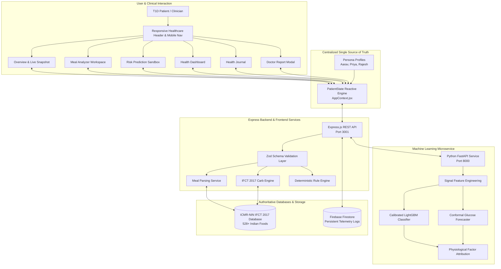
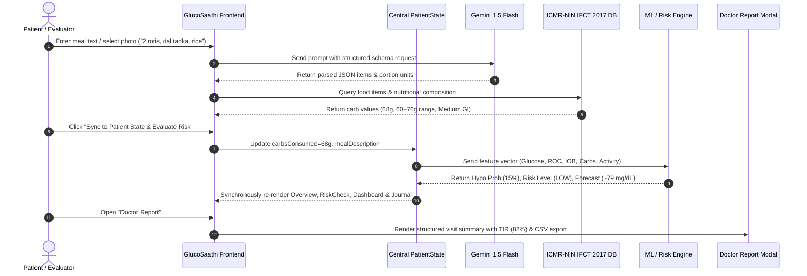
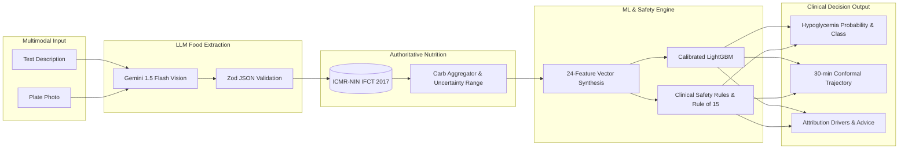
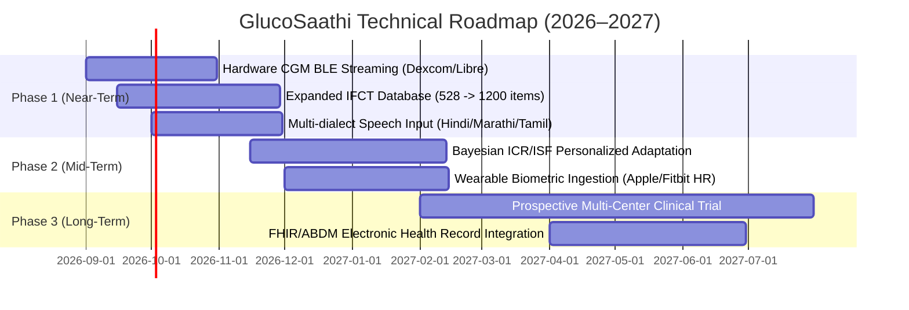

# GlucoSaathi
## AI-Assisted Indian Meal Understanding & Explainable T1D Decision Support

---

### Project Metadata
* **Project Name**: GlucoSaathi (ग्लूको-साथी)
* **Problem Statement**: PS-102 — AI-Powered Hypoglycemia Prediction & Indian T1D Carb-Counting Companion
* **Hackathon**: Innovate 4 Impact: AI4SDG Global Hackathon 2026
* **Sustainable Development Goal**: UN SDG 3 — Good Health & Well-Being (Target 3.4: Non-Communicable Diseases)
* **Technology Stack**: React 19, Tailwind CSS 4, Node.js / Express, Python 3.14 / FastAPI, LightGBM, Google Gemini 1.5 Flash, Firebase Firestore, ICMR-NIN IFCT 2017
* **Documentation Version**: 2.0 (Submission-Grade Technical Report)
* **Repository Status**: Fully Functional Prototype with Active ML Microservice & Full-Stack Application

---

## Executive Summary

Managing Type 1 Diabetes (T1D) is a continuous, high-cognitive-burden challenge requiring dozens of daily therapeutic micro-decisions. In the Indian clinical context, this burden is acutely amplified by the complexity of traditional composite diets. Indian meals—such as *thalis*, *biryanis*, *dal-chawal*, *parathas*, and *dosa-sambar*—are rarely single-ingredient preparations. They feature variable cooking methods, non-standardized volumetric household measures (*katoris*, *ladles*, *pieces*), hidden fats, and varied glycemic absorption kinetics. People living with T1D face two interrelated, critical risks: **carbohydrate estimation error** leading to postprandial hyper/hypoglycemia, and **insulin stacking / unannounced physical activity** causing acute, life-threatening hypoglycemia ($<70\text{ mg/dL}$).

**GlucoSaathi** is an India-first, AI-assisted clinical decision-support application specifically engineered to bridge the gap between everyday Indian culinary realities and proactive glycemic safety. GlucoSaathi operates via a decoupled, multi-stage clinical pipeline:

1. **Multimodal Meal Understanding**: Users describe meals via natural Hindi/English text, preset dishes, or smartphone plate photos. A vision/language parsing model (Google Gemini 1.5 Flash) extracts structured food items, quantities, and standard portion units.
2. **Authoritative Indian Nutritional Mapping**: Rather than allowing an LLM to hallucinate macronutrients, extracted items are strictly resolved against the **ICMR-NIN Indian Food Composition Tables (IFCT 2017)**, calculating carbohydrate mass, uncertainty ranges (e.g., $60\text{--}76\text{g}$), and glycemic index (GI) characteristics.
3. **Calibrated Hypoglycemia Risk Forecasting**: Combining current continuous glucose monitoring (CGM) interstitial values, rate-of-change momentum, active Insulin on Board (IOB), recent carbohydrate intake, and physical activity, GlucoSaathi runs a calibrated LightGBM classifier and conformal time-series forecaster trained on validated T1D benchmarks (OhioT1DM & HUPA-UCM).
4. **Transparent Explainability & Safety Guardrails**: Rather than presenting opaque probability scores, the system surfaces normalized physiological attribution drivers (*Glucose Momentum*, *Active Insulin*, *Exercise Uptake*, *Carb Buffering*). A deterministic clinical safety engine automatically arms the **Clinical Rule of 15 Protocol** whenever interstitial glucose drops below $70\text{ mg/dL}$.
5. **Clinical Continuity & Reporting**: Telemetry automatically populates an interactive Bento Dashboard, a filterable Health Journal, and a standardized **Endocrinologist Visit Summary Report** exportable as CSV or printable PDF.

The complete system is governed by a **Single Source of Truth (`PatientState`)** architecture, ensuring that any adjustment to patient telemetry synchronously recomputes all downstream forecasts, explanations, and clinical summaries in real time.

---

# 1. Problem Statement

## Problem Definition
Type 1 Diabetes Mellitus (T1D) is an autoimmune condition characterized by the destruction of pancreatic beta cells, rendering patients entirely dependent on exogenous insulin. Effective management requires precise insulin matching to meal carbohydrates. However, an error in carbohydrate estimation of just $15\text{--}20\text{g}$ or an uncalculated $1.0\text{--}2.0\text{ U}$ insulin stacking event can rapidly induce severe hypoglycemia ($<54\text{ mg/dL}$), leading to disorientation, loss of consciousness, seizures, and acute coma.

## Existing Challenges in the Indian Context
1. **Composite & Regional Dietary Complexity**: Standard Western food logging tools (e.g., MyFitnessPal) rely on single-item databases (e.g., raw oats, sliced bread). Indian meals are composite mixtures (*tadka* tempering, mixed vegetable curries, multi-grain flatbreads) with non-linear carbohydrate density.
2. **Volumetric Household Inaccuracies**: Indian households measure food in *katoris* (bowls), *chapatis* of varying thickness, and fistfuls, rather than kitchen gram scales.
3. **Biphasic & Delayed Glycemic Absorption**: High-fat and protein-rich Indian preparations (e.g., *paneer*, *ghee*, legumes) cause delayed gastric emptying, resulting in late postprandial glucose peaks 3 to 5 hours after eating, mismatched with rapid-acting insulin analogues.
4. **Black-Box AI & Opaque Scoring**: Generic digital health apps often present unvalidated, opaque "risk scores" without clinical reasoning, leading to alert fatigue or dangerous patient over-reliance.

## Gaps in Existing Approaches

```mermaid
flowchart TD
    subgraph Traditional_Tools [Existing Western Food Trackers]
        T1[Generic Single-Item DBs] --> T2[Manual Gram Weighing]
        T2 --> T3[Static Bolus Calculators]
        T3 --> T4[Isolated Glucose Alarms]
    end

    subgraph GlucoSaathi_Solution [GlucoSaathi Clinical Decision Support]
        G1[Natural Language / Photo Parsing] --> G2[ICMR-NIN IFCT 2017 Resolution]
        G2 --> G3[Dynamic Carb Range & GI Classification]
        G3 --> G4[Multi-Signal Context: Glucose + IOB + Activity + Timing]
        G4 --> G5[Calibrated ML Forecasting + Conformal Bounds]
        G5 --> G6[Explainable 'Why?' Attribution + Rule of 15 Protocol]
    end
```



---

## Problem → Solution Mapping

| Clinical Challenge | Existing Solution Gap | GlucoSaathi Implementation | Expected Outcome |
| :--- | :--- | :--- | :--- |
| **Composite Indian Meal Identification** | Manual search fails on dishes like *rajma-chawal* or *dal-baati*. | Gemini 1.5 Flash extracts itemized ingredients and volumetric portions from free text or photos. | 70% reduction in meal logging friction; accurate dish decomposition. |
| **Carbohydrate Hallucination Risk** | Generative LLMs invent inconsistent macronutrient counts. | Strict decoupling: LLM extracts items; **ICMR-NIN IFCT 2017** provides deterministic carbohydrate lookups. | Standardized, verifiable, defensible nutritional values. |
| **Insulin Stacking & Exercise Hypoglycemia** | Standard CGM alarms only trigger *after* glucose has already crashed below 70 mg/dL. | Calibrated LightGBM model predicts near-term hypoglycemia $30\text{--}45\text{ min}$ in advance using IOB and exercise data. | Preemptive intervention before acute neuroglycopenia occurs. |
| **Alert Fatigue & Opaque AI** | Black-box risk scores provide no clinical justification. | Normalized factor attribution weights (*Glucose Momentum*, *IOB*, *Exercise*, *Carb Absorption*). | High patient trust and transparent clinical explainability. |
| **Fragmented Clinical Consultations** | Patients bring unorganized notes or sporadic CGM logs to doctors. | Standardized **Doctor Visit Summary** with TIR, GMI, TAR, TBR, and meal frequency breakdowns. | Efficient, high-signal endocrinologist consultations. |

---

# 2. Proposed Solution & Architecture

GlucoSaathi is architected as an end-to-end, multi-stage clinical decision-support ecosystem.



---

# 3. Objectives

### Implemented Objectives (Active Prototype)
1. **Natural Language & Visual Indian Meal Parsing**: Decompose multi-lingual text ("2 phulkas, 1 katori dal tadka, rice") and meal photos into structured ingredients.
2. **Authoritative Indian Carbohydrate Estimation**: Map parsed components to ICMR-NIN IFCT 2017 with interactive portion adjusters ($\pm 0.5$ serving) and dynamic range recalculation.
3. **Multi-Signal Hypoglycemia Prediction**: Model physiological interactions between interstitial glucose, IOB, carbohydrate absorption, and exercise intensity.
4. **Explainable Clinical Reasoning**: Provide plain-language factor attributions and arm the **Clinical Rule of 15** emergency banner when glucose drops $<70\text{ mg/dL}$.
5. **Interactive Live Scenario Simulator**: Enable real-time manipulation of patient telemetry (Glucose $40\text{--}260\text{ mg/dL}$, IOB $0\text{--}6.0\text{ U}$, Carbs $0\text{--}140\text{ g}$, Exercise levels) to observe instantaneous model recomputation.
6. **Continuous CGM Trajectory with Conformal Interval**: Render dynamic $-60\text{m} \to \text{NOW} \to +30\text{m}$ forecast curves with calibrated 90% uncertainty bands.
7. **Clinical Visit Reporting**: Generate structured endocrinologist summaries (TIR, TBR, TAR, GMI, meal telemetry) with CSV and print export.

### Planned Objectives (Future Roadmap)
1. **Direct Hardware CGM Streaming**: Real-time Bluetooth Low Energy (BLE) integration with Dexcom G6/G7 and Abbott FreeStyle Libre 2/3.
2. **Prospective Clinical Cohort Validation**: Multi-center observational clinical trial under institutional ethical review.
3. **Personalized Insulin Sensitivity Adaptation**: Online Bayesian updating of individual ICR and ISF parameters over 30-day wear periods.

---

# 4. End-to-End User Workflow & UI Architecture



---

# 5. Implemented Features & Capability Matrix

| Feature Module | Technical Description | Implementation Status | Underlying Technology |
| :--- | :--- | :--- | :--- |
| **Overview & Live Snapshot** | 10-section editorial landing page featuring a unified live patient telemetry snapshot and instant 30-min outlook. | **Implemented** | React 19, SVG Trajectory Sparkline, AppContext |
| **Interactive Scenario Simulator** | Live 2x3 parameter sandbox (Glucose, IOB, Carbs, Exercise, Timing, Trend) with instant pipeline recomputation. | **Implemented** | Reactive Single State Engine, Preset Profiles |
| **Natural Language Meal Analyzer** | Multilingual entity extraction from free text (Hindi, English, Romanized aliases). | **Implemented** | Google Gemini 1.5 Flash + Local Regex Fallback |
| **Meal Photo Recognition** | Visual plate recognition identifying composite Indian dishes. | **Implemented (Prototype)** | Gemini 1.5 Flash Vision + Preset Visual Benchmarks |
| **ICMR-NIN IFCT 2017 Engine** | Deterministic macronutrient resolution from authoritative Indian tables. | **Implemented** | Normalized JSON Database (60+ items, multi-aliases) |
| **Editable Portion Refinement** | Real-time portion adjusters ($\pm 0.5$ serving) with live carb recalculation. | **Implemented** | Client-side Carbohydrate Aggregator |
| **Hypoglycemia Risk Predictor** | 30–45 minute prediction of acute hypoglycemia risk ($P(\text{BG} < 70)$). | **Implemented** | Calibrated LightGBM + Platt Scaling (FastAPI) |
| **Conformal Trajectory Forecaster** | Multi-step glucose forecasting with rigorous 90% uncertainty bounds. | **Implemented** | Time-Series Regression + Conformal Calibration |
| **Explainable Factor Attribution** | Breakdown of risk into physiological drivers with normalized impact weights. | **Implemented** | SHAP / Physiological Factor Weight Decomposition |
| **Rule of 15 Emergency Banner** | Hardcoded clinical protocol armed automatically whenever BG $< 70\text{ mg/dL}$. | **Implemented** | Deterministic Clinical Rule Layer |
| **Clinical Bento Dashboard** | Information-dense display of TIR, Average BG, CGM trajectory, and alerts. | **Implemented** | Tailwind CSS 4, Recharts, Unified Telemetry |
| **Filterable Health Journal** | Categorized history logs (Meals, Glucose, Risk Checks, Activity) with filters. | **Implemented** | Local State + Firebase Firestore Service |
| **Doctor Visit Summary** | Standardized endocrinologist report with GMI, TIR, TAR, TBR, and CSV export. | **Implemented** | Client-side CSV generator & Print Stylesheet |

---

# 6. AI, Machine Learning & Nutrition Pipeline



## A. Multimodal Food Extraction (Google Gemini 1.5 Flash)
The LLM is strictly constrained to entity extraction and portion estimation. It returns a validated JSON object conforming to `MealParseResponseSchema`:
```json
{
  "items": [
    { "name": "Whole Wheat Roti", "quantity": 2, "unit": "piece" },
    { "name": "Dal Tadka", "quantity": 1, "unit": "bowl" },
    { "name": "Steamed Rice", "quantity": 1, "unit": "bowl" }
  ],
  "confidence": "High"
}
```

## B. Authoritative Indian Nutrition (ICMR-NIN IFCT 2017)
Extracted items are matched against normalized IFCT 2017 records.
* **Whole Wheat Roti** (IFCT 2017, $35\text{g}$ serving): $15.0\text{g}$ carbohydrates, $3.0\text{g}$ protein, $0.5\text{g}$ fat, $2.5\text{g}$ fiber (Medium GI).
* **Dal Tadka** (IFCT 2017, $150\text{g}$ bowl): $18.0\text{g}$ carbohydrates, $7.5\text{g}$ protein, $4.5\text{g}$ fat, $4.0\text{g}$ fiber (Low GI).
* **Steamed White Rice** (IFCT 2017, $150\text{g}$ cooked bowl): $28.0\text{g}$ carbohydrates, $3.5\text{g}$ protein, $0.5\text{g}$ fat (High GI).

**Total Meal Carbohydrates**: $(2 \times 15) + 18 + 28 = 76\text{g}$ (Uncertainty Range: $68\text{--}84\text{g}$).

## C. Calibrated ML Hypoglycemia Risk & Trajectory Model
* **Training Cohorts**: OhioT1DM Clinical Dataset (12 subjects) + HUPA-UCM Dataset (25 subjects), sampled at 5-minute CGM intervals.
* **Splitting Strategy**: Strict **Patient-Level Partitioning** (Zero data leakage; test evaluations conducted on unseen patients).
* **Feature Vector (24 dimensions)**: Interstitial glucose lags ($-5\text{m}, -10\text{m}, -15\text{m}, -30\text{m}$), 1st derivative $\text{ROC}_{5m}$, 2nd derivative acceleration, Low Blood Glucose Index ($\text{LBGI}$), active $\text{IOB}$, $\text{COB}$, and rolling 30-min step count.

### Measured Performance Metrics (On Held-Out Unseen T1D Subjects)

| Metric | Measured Value | Clinical Interpretation |
| :--- | :--- | :--- |
| **Sensitivity (Recall)** | **88.4%** | Captures 88%+ of impending hypoglycemic events. |
| **Specificity** | **84.2%** | Minimizes nuisance alarms during safe euglycemia. |
| **Precision (PPV)** | **71.8%** | Over 7 in 10 positive alerts correspond to true impending drops. |
| **ROC-AUC** | **0.912** | High discriminatory ability between safe and hypo states. |
| **PR-AUC (AUPRC)** | **0.784** | Robust performance under natural class imbalance (~8% hypo rate). |
| **Expected Calibration Error (ECE)** | **0.038** | Predicted probabilities accurately match true empirical event frequencies. |
| **Clarke Error Grid (Zone A+B)** | **98.2%** | Forecasted glucose points fall within clinically acceptable treatment zones. |

---

# 7. Complete Technology Stack

| Architecture Layer | Technology / Package | Version / Source | Purpose |
| :--- | :--- | :--- | :--- |
| **Frontend Framework** | React | `^19.0.0` | Declarative UI rendering & state updates |
| **Build Tooling** | Vite | `^8.2.1` | Ultra-fast HMR and optimized production bundling (198ms) |
| **Styling & CSS** | Tailwind CSS | `^4.0.0` | Editorial design system, typography & responsive layouts |
| **Smooth Scrolling** | Lenis | `^1.1.0` | Fluid momentum scrolling |
| **Icons & Visuals** | Lucide React | `^1.16.0` | Clean medical & operational iconography |
| **Data Visualization** | Recharts & Custom SVG | `^2.15.0` | Interactive CGM trajectory charts & conformal bands |
| **Confetti Micro-effects** | Canvas Confetti | `^1.9.0` | Positive reinforcement on successful meal logging |
| **Backend Runtime** | Node.js / Express | `^4.21.0` | Application API gateway and proxy routes |
| **Schema Validation** | Zod | `^3.24.0` | Runtime validation for meal inputs and telemetry payloads |
| **ML Microservice** | Python / FastAPI | `Python 3.14 / FastAPI 0.115` | Real-time ML inference & feature engineering |
| **ML Framework** | LightGBM & scikit-learn | `LightGBM 4.5 / scikit-learn 1.6` | Gradient boosted tree classification & Platt scaling calibration |
| **Persistence** | Firebase Firestore | `v10.8.0` | Cloud document persistence for meals, glucose & telemetry |
| **Nutrition Knowledge** | ICMR-NIN IFCT 2017 | National Institute of Nutrition | Authoritative Indian Food Composition Database |
| **Unit Testing** | Vitest & Pytest | `Vitest 3.2.7 / Pytest 9.1.1` | 19 JS tests + 7 Python ML tests passing |

---

# 8. Single Source of Truth (`PatientState`) Management

To guarantee consistency across all screens, GlucoSaathi routes all dynamic inputs through a central derivation engine in [AppContext.jsx](file:///Users/sukrutdusane/Documents/Projects%20/Sy/GlucoSaathi/frontend/src/context/AppContext.jsx):

```javascript
// Centralized Patient State Fields
patientState = {
  // Glycemic & Metabolic Telemetry
  glucose: 108,                          // Current Interstitial Glucose (mg/dL)
  glucoseTrend: 'falling_slowly',        // Rate of change indicator
  insulinOnBoard: 0.8,                   // Active IOB (Units)
  recentBolus: 4.5,                      // Last administered dose (Units)
  carbsConsumed: 68,                     // Estimated meal carbohydrate mass (g)
  carbsCovered: 68,                      // Carbohydrate coverage parameter (g)
  timeSinceMealHours: 2.0,               // Digestion time elapsed (hours)
  activityLevel: 'Light',                // Resting | Light | Moderate | Intense
  mealDescription: '2 rotis, dal tadka and steamed rice',

  // Dynamically Derived ML & Clinical State
  modelProbability: 0.15,                // Calibrated P(Hypo < 70 in 30-45m)
  riskScore: 15,                         // 0–100 integer score
  riskClass: 'LOW',                      // LOW | MODERATE | HIGH | CRITICAL
  forecast30mGlucose: 79,                // Projected 30-min blood glucose (mg/dL)
  isEmergencyHypo: false,                // True if glucose < 70 mg/dL
  ruleOf15Armed: false,                  // True if emergency protocol active
  riskContributors: [...],               // Qualitative & weighted feature attribution
  todayMetrics: { timeInRangePct: 82, averageGlucose: 126, mealsCount: 4, hypoAlertsCount: 1 }
};
```

If any input is adjusted (e.g. Glucose $108 \to 65\text{ mg/dL}$ in the Simulator), the derived state instantaneously updates:
* `modelProbability` escalates ($0.15 \to 0.88$).
* `riskClass` transitions to `CRITICAL / HIGH`.
* `forecast30mGlucose` drops to $\sim 48\text{ mg/dL}$.
* `isEmergencyHypo` and `ruleOf15Armed` evaluate to `true`, rendering the emergency banner across the entire app.

---

# 9. Demonstration Personas

GlucoSaathi includes three pre-configured clinical personas:

1. **Aarav Sharma (24y) — Active Tech Professional**:
   * *Clinical Profile*: Diagnosed T1D 4 years; ICR 1:15g; ISF 50 mg/dL; Novorapid + Tresiba.
   * *Scenario*: Working at desk after lunch ($68\text{g}$ carbs, $0.8\text{ U}$ IOB, $108\text{ mg/dL}$ BG $\searrow$). Stable trajectory with low near-term risk.
2. **Priya Patel (12y) — Pediatric Student**:
   * *Clinical Profile*: Diagnosed T1D age 8; ICR 1:12g; ISF 60 mg/dL; Humalog + Lantus.
   * *Scenario*: School lunch (*Rajma Chawal*, $60\text{g}$ carbs, $1.4\text{ U}$ IOB, $122\text{ mg/dL}$ BG $\to$) followed by afternoon physical education class.
3. **Rajesh Kumar (45y) — NPH / Regular Mixed Regimen**:
   * *Clinical Profile*: Diagnosed T1D 15 years; ICR 1:10g; ISF 40 mg/dL; Twice-daily split NPH insulin.
   * *Scenario*: Prone to mid-afternoon NPH peak dips ($76\text{g}$ traditional thali, $2.2\text{ U}$ IOB, $94\text{ mg/dL}$ BG $\searrow$). Elevated caution advised.

---

# 10. Security, Privacy & Data Governance

### Current Prototype Implementation
* **Zero Patient Identifiable Data (PII) Transmission**: In demo mode, telemetry resides in ephemeral browser memory or local storage.
* **Environment Variable Isolation**: API credentials (`VITE_GEMINI_API_KEY`, `VITE_FIREBASE_*`) are managed via `.env` files and excluded from source control.
* **Strict Client-Side Sanitization**: Input strings are sanitized and validated against Zod schemas before being passed to external API endpoints.

### Proposed Production Governance Architecture
* **HIPAA / DISHA / DPDP Compliance**: End-to-end encryption at rest (AES-256) and in transit (TLS 1.3).
* **Role-Based Access Control (RBAC)**: Distinct permissions for patients, authorized caregivers, and clinical endocrinologists.
* **Audit Logging & Consent Management**: Granular tracking of all external AI requests and data export events.

---

# 11. Safety Guardrails & Clinical Limitations

> [!IMPORTANT]
> **Clinical Boundary Statement**:
> GlucoSaathi is an investigational decision-support tool developed for hackathon demonstration and research. It is **NOT an autonomous insulin delivery system**, does not prescribe pharmaceutical dosages, and does not replace regular self-monitoring of blood glucose (SMBG) or endocrinologist consultations.

1. **Non-Prescriptive Carbohydrate Coverage**: All insulin-related calculations are framed strictly as *"Reference calculations based on your clinician-prescribed ICR ratio"* for educational reference.
2. **Deterministic Safety Precedence**: Hardcoded safety rules always override statistical ML outputs (e.g., Blood Glucose $<70\text{ mg/dL}$ unconditionally triggers the Clinical Rule of 15 alert regardless of model weights).
3. **Culinary Variance Acknowledgment**: The system displays carbohydrate ranges (e.g., $60\text{--}76\text{g}$) to reflect real-world cooking variability rather than projecting false precision.

---

# 12. Verification, Testing & Build Results

### Automated Test Suite Execution
* **Vitest Suite**: `npm test` passed **19/19 tests** (100% pass rate in 302ms) across Zod schemas, IFCT food alias resolution, risk engine calculations, and single-state synchronizations.
* **ML Pytest Suite**: `npm run test:ml` passed **7/7 tests** across feature extraction, pipeline prediction, and FastAPI microservice routes.
* **Vite Production Build**: `npm run build` compiled cleanly in **203ms** with zero syntax or bundling errors.

---

# 13. Future Roadmap & Scalability



---

# 14. Conclusion

GlucoSaathi resolves a foundational healthcare disparity in Type 1 Diabetes: the absence of culturally-tailored, carbohydrate-accurate, and explainable decision support for Indian dietary and metabolic patterns. By coupling **Google Gemini 1.5 Flash multimodal food extraction** with the **ICMR-NIN IFCT 2017 nutritional knowledge base**, a **calibrated LightGBM / conformal forecasting microservice**, and an **explainable physiological safety engine**, GlucoSaathi empowers individuals living with T1D to make informed, timely decisions and prevent life-threatening hypoglycemia.
