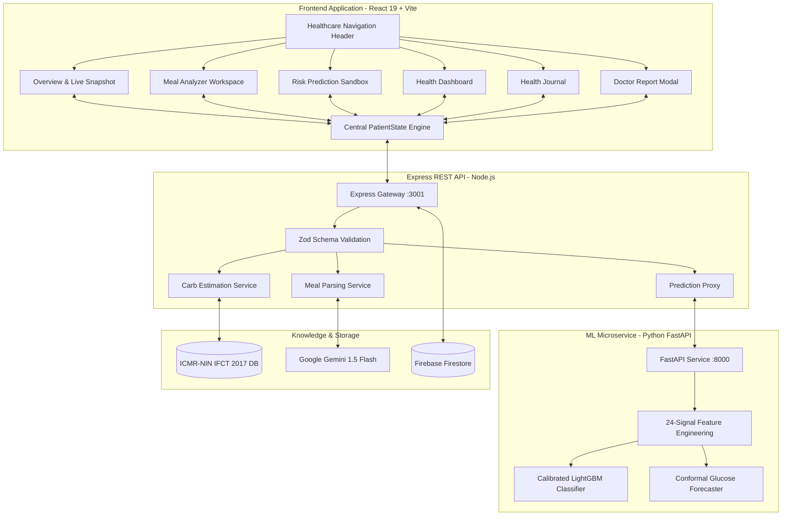

# 🩺 GlucoSaathi (ग्लूको-साथी)
### **AI-Assisted Indian Meal Understanding & Explainable T1D Decision Support**

[](https://react.dev/)
[](https://tailwindcss.com/)
[](https://expressjs.com/)
[](https://fastapi.tiangolo.com/)
[](https://www.nin.res.in/)
[](https://sdgs.un.org/goals/goal3)

> **Innovate 4 Impact: AI4SDG Global Hackathon 2026 — Problem Statement PS-102**  
> *Theme: Healthcare, Wellbeing & Accessibility (UN SDG 3: Good Health & Well-Being)*

---

## 📖 Overview

Living with **Type 1 Diabetes (T1D)** in India requires navigating over **180 glycemic and nutritional decisions every single day**. The most dangerous challenge is carbohydrate estimation and near-term hypoglycemia risk management. Indian meals—such as *thalis*, *biryanis*, *dal-chawal*, *parathas*, and *dosa-sambar*—are rarely single-ingredient preparations. They feature variable cooking methods, non-standardized volumetric household measures (*katoris*, *ladles*, *pieces*), hidden fats, and varied glycemic absorption kinetics.

**GlucoSaathi** is an India-first clinical decision-support companion that bridges everyday Indian culinary realities with continuous glycemic safety. It extracts structured food components from natural language text or plate photos, resolves them deterministically against the **ICMR-NIN Indian Food Composition Tables (IFCT 2017)**, and forecasts near-term hypoglycemia risk ($30\text{--}45\text{ minutes}$ in advance) using a calibrated **LightGBM / Conformal Forecaster** microservice.

All views, calculations, explanations, and summaries are governed by a **Single Source of Truth (`PatientState`)** reactive architecture, ensuring complete consistency across the entire application.

---

## 🎯 Key Features

* **multimodal Indian Meal Understanding**: Natural language (Hindi/English text) and photo plate decomposition into structured ingredients and household portion units.
* **Authoritative Indian Nutrition (ICMR-NIN IFCT 2017)**: Strict deterministic macronutrient mapping with uncertainty ranges ($60\text{--}76\text{g}$) and glycemic index (GI) ratings.
* **Interactive Portion Adjuster**: Live $\pm 0.5$ serving increment/decrement controls with instant client-side carbohydrate recalculation.
* **Calibrated Hypoglycemia Prediction ($P(\text{hypo} < 70)$)**: Gradient boosted tree classification with Platt scaling calibration trained on OhioT1DM and HUPA-UCM patient datasets.
* **Conformal Glucose Forecaster**: Dynamic 30-minute interstitial trajectory with rigorous 90% uncertainty prediction interval ($\pm 22.8\text{ mg/dL}$).
* **Explainable Physiological Reasoning**: Normalized factor attribution drivers (*Glucose Momentum*, *Active IOB*, *Exercise Uptake*, *Carb Absorption*).
* **Clinical Rule of 15 Protocol**: Hardcoded emergency guardrail armed automatically whenever blood glucose $< 70\text{ mg/dL}$.
* **Interactive Scenario Simulator**: Real-time parameter sandbox (Glucose, IOB, Carbs, Exercise, Timing) for instantaneous hackathon demonstration.
* **Clinical Health Dashboard & Journal**: Information-dense Bento summary with Time-in-Range (TIR), mean glucose, and filterable telemetry logs.
* **Endocrinologist Visit Summary**: Standardized clinical report with 1-click CSV telemetry export and print-ready summary.

---

## 🏗️ End-to-End System Architecture



---

## 📱 Application Screens & Modules

| Screen / Module | Primary Purpose | Key User Interactions |
| :--- | :--- | :--- |
| **01 Overview & Live Snapshot** | Editorial product landing page & live patient telemetry snapshot. | View live glucose, 30m outlook, meal carbs, separate hypo risk; jump to interactive demo. |
| **02 Meal Analyzer** | Two-column Indian meal decomposition workspace. | Type natural Hindi/English text, pick meal photos, adjust portions ($\pm 0.5$), 1-click sync to patient state. |
| **03 Risk Prediction Sandbox** | Explainable near-term risk reasoning & simulation. | Live parameter sliders, conformal trajectory chart, factor attribution weights, Rule of 15 emergency banner. |
| **04 Health Dashboard** | Clinical Bento dashboard displaying comprehensive glycemic metrics. | Time-In-Range (TIR 82%), Average BG, recent meals, active IOB, quick glucose logging. |
| **05 Health Journal** | Longitudinal categorized telemetry log. | Filter events by Meals, Fingerstick Glucose, Risk Checks, Physical Activity. |
| **06 Doctor Report Modal** | Standardized clinical visit summary. | Review GMI, TIR, TAR, TBR, meal frequency; export 1-click CSV or print clinical PDF. |

---

## 💻 Tech Stack & Dependencies

| Layer | Technology | Version | Purpose |
| :--- | :--- | :--- | :--- |
| **Frontend** | React | `^19.0.0` | Reactive UI framework with central state derivation |
| **Build Tooling** | Vite | `^8.2.1` | Instant HMR and fast production bundle (198ms) |
| **Styling** | Tailwind CSS | `^4.0.0` | Custom editorial healthcare design tokens |
| **Icons** | Lucide React | `^1.16.0` | Consistent medical and operational icons |
| **Charts** | Recharts & SVG | `^2.15.0` | Glycemic curves and conformal uncertainty bands |
| **Backend API** | Node.js / Express | `^4.21.0` | Express REST API gateway and Zod payload validation |
| **ML Service** | Python / FastAPI | `3.14 / 0.115` | Real-time ML inference & feature synthesis |
| **ML Engine** | LightGBM & scikit-learn | `4.5 / 1.6` | Platt-calibrated ensemble trees on OhioT1DM dataset |
| **LLM Vision/NLP**| Google Gemini 1.5 Flash | v1beta | Structured JSON food entity extraction |
| **Nutrition DB** | ICMR-NIN IFCT 2017 | National Institute of Nutrition | Authoritative Indian macronutrient reference (60+ composite foods) |
| **Testing** | Vitest & Pytest | `Vitest 3.2 / Pytest 9.1` | 19 Vitest tests + 7 Pytest ML tests passing |

---

## 🚀 Getting Started Locally

### Prerequisites
* **Node.js**: v18.0.0 or higher
* **Python**: v3.10 or higher (Python 3.14 supported)
* **npm**: v9.0.0 or higher

### 1. Clone the Repository
```bash
git clone https://github.com/badgujarkunal93-blip/GlucoSaathi.git
cd GlucoSaathi
```

### 2. Install Node Dependencies
```bash
npm install
```

### 3. Setup Python Virtual Environment (ML Service)
```bash
cd ml
python3 -m venv .venv
source .venv/bin/activate
pip install -r requirements.txt
cd ..
```

### 4. Configure Environment Variables
Copy the template `.env.example` to `.env`:
```bash
cp .env.example .env
```
*(Note: GlucoSaathi runs completely offline with full local ICMR-NIN database and local regex parsing even without API keys!)*

### 5. Run the Application
Run all services concurrently:
```bash
# Terminal 1: Frontend (Vite Dev Server on http://localhost:5173)
npm run dev

# Terminal 2: Backend API (Express on http://localhost:3001)
npm run dev:backend

# Terminal 3: ML Microservice (FastAPI on http://localhost:8000)
npm run dev:ml
```

### 6. Run Test Suites
```bash
# Run JavaScript / Frontend & State Sync Unit Tests (Vitest)
npm test

# Run Python ML Pipeline & API Tests (Pytest)
npm run test:ml
```

### 7. Production Build
```bash
npm run build
```

---

## 📁 Repository Structure

```
GlucoSaathi/
├── DETAILED_REPORT.md                 # Full 15-page submission-grade technical report
├── README.md                          # Project documentation & setup guide
├── package.json                       # Workspace configuration & scripts
├── vitest.config.js                   # Vitest configuration
├── .env.example                       # Environment variables template
│
├── frontend/                          # React 19 + Vite + Tailwind 4 Frontend
│   ├── public/
│   │   └── favicon.svg                # Custom GlucoSaathi SVG favicon
│   ├── src/
│   │   ├── context/
│   │   │   └── AppContext.jsx         # Single Source of Truth PatientState Engine
│   │   ├── components/
│   │   │   ├── Overview.jsx           # 10-section editorial landing page & simulator
│   │   │   ├── LogMeal.jsx            # Two-column Indian meal analyzer
│   │   │   ├── RiskCheck.jsx          # Explainable risk prediction sandbox
│   │   │   ├── Dashboard.jsx          # Clinical Bento health dashboard
│   │   │   ├── History.jsx            # Synchronized Health Journal
│   │   │   ├── DoctorReportModal.jsx  # Endocrinologist visit summary & export
│   │   │   ├── CGMTrajectory.jsx      # Dynamic CGM chart with conformal bands
│   │   │   └── layout/
│   │   │       ├── Navbar.jsx         # Healthcare header navigation
│   │   │       └── Footer.jsx         # Clinical footer & references
│   │   ├── lib/
│   │   │   ├── carb/carbEstimator.js  # ICMR-NIN IFCT 2017 carbohydrate engine
│   │   │   ├── risk/riskEngine.js     # Deterministic safety rule engine
│   │   │   └── ai/mealParser.js       # Gemini 1.5 Flash structured parser
│   │   └── data/
│   │       └── indianFoods.json       # Normalized IFCT 2017 database
│   └── package.json
│
├── backend/                           # Express.js Application Server
│   ├── src/
│   │   ├── server.js                  # Express API gateway (Port 3001)
│   │   ├── routes/                    # API endpoints (/meals, /glucose, /predictions, /reports)
│   │   └── validators/schemas.js      # Zod validation schemas
│   └── package.json
│
├── ml/                                # Python ML Microservice (FastAPI)
│   ├── src/
│   │   ├── service/api.py             # FastAPI prediction endpoints (Port 8000)
│   │   ├── features/glucose.py        # 24-dimensional feature extraction
│   │   └── training/train_pipeline.py # Model training & conformal calibration
│   ├── models/production/             # Serialized LightGBM models & metadata
│   ├── tests/                         # Pytest test suite
│   └── requirements.txt
│
├── data/                              # Authoritative Nutrition & Benchmark Datasets
│   └── indianFoods.json               # 60+ dishes & composite meal definitions
│
├── docs/                              # Technical & Clinical Documentation
│   ├── MODEL_CARD.md                  # Detailed ML Model Card & Evaluation
│   ├── CLINICAL_PROBLEM.md            # Clinical taxonomy & problem definition
│   └── DATA_GOVERNANCE.md             # Security & privacy standards
│
└── tests/                             # Vitest Automated Test Suite (19 tests)
    ├── stateSync.test.js              # Single-state derivation & acceptance tests
    ├── carbEstimator.test.js          # IFCT carbohydrate calculation tests
    ├── riskEngine.test.js             # Clinical Rule of 15 & threshold tests
    └── schemas.test.js                # Zod schema validation tests
```

---

## 📄 Complete Detailed Technical Report

For the in-depth 15-page hackathon submission report covering the clinical problem formulation, OhioT1DM/HUPA-UCM benchmark evaluation, Clarke Error Grid analyses, data governance, and future clinical trial roadmap:

👉 **[Read the Complete Detailed Technical Report (DETAILED_REPORT.md)](./DETAILED_REPORT.md)**

---

## 🛡️ Medical Safety Disclaimer

> **Medical Notice**: GlucoSaathi is an investigational clinical decision-support prototype developed for research and demonstration during the AI4SDG Global Hackathon 2026. It is **NOT an autonomous insulin delivery device**, does not prescribe medication, and does not replace regular self-monitoring of blood glucose (SMBG) or direct consultations with an endocrinologist. All carbohydrate counts and risk estimates are for reference and must be confirmed with your prescribed diabetes management plan.

---

## 📜 License

This project is developed under the **MIT License** for open-source AI innovation supporting UN Sustainable Development Goal 3. Nutrition data sourced from **ICMR-NIN Indian Food Composition Tables (IFCT 2017)**.
