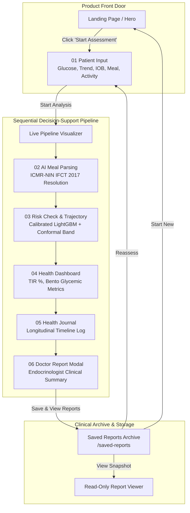

# 🩺 GlucoSaathi (ग्लूको-साथी)
### **AI-Assisted Indian Meal Understanding & Explainable T1D Decision Support**

[](https://react.dev/)
[](https://tailwindcss.com/)
[](https://expressjs.com/)
[](https://fastapi.tiangolo.com/)
[](https://www.nin.res.in/)
[](https://vercel.com/)
[](https://sdgs.un.org/goals/goal3)

> **Innovate 4 Impact: AI4SDG Global Hackathon 2026 — Problem Statement PS-102**  
> *Theme: Healthcare, Wellbeing & Accessibility (UN SDG 3: Good Health & Well-Being)*

---

## 📖 Overview

Living with **Type 1 Diabetes (T1D)** in India requires navigating over **180 glycemic and nutritional decisions every single day**. The most dangerous challenge is carbohydrate estimation and near-term hypoglycemia risk management. Indian meals—such as *thalis*, *biryanis*, *dal-chawal*, *parathas*, and *dosa-sambar*—are rarely single-ingredient preparations. They feature variable cooking methods, non-standardized volumetric household measures (*katoris*, *ladles*, *pieces*), hidden fats, and varied glycemic absorption kinetics.

**GlucoSaathi** is an India-first clinical decision-support companion that bridges everyday Indian culinary realities with continuous glycemic safety. It extracts structured food components from natural language text or plate photos, resolves them deterministically against the **ICMR-NIN Indian Food Composition Tables (IFCT 2017)**, and forecasts near-term hypoglycemia risk ($30\text{--}45\text{ minutes}$ in advance) using a calibrated **LightGBM / Conformal Forecaster** microservice.

---

## 🧭 Application Architecture: Two Distinct Modes

GlucoSaathi decouples the public-facing product introduction from the dense clinical assessment workflow:

```text
┌────────────────────────────────────────────────────────────┐
│ 1. MARKETING / HERO FRONT DOOR (appMode: 'landing')        │
│    Cinematic, Spacious, Conceptual Intelligence Visual     │
└─────────────────────────────┬──────────────────────────────┘
                              │ [ START ASSESSMENT ➔ ]
                              ▼
┌────────────────────────────────────────────────────────────┐
│ 2. CLINICAL DECISION PIPELINE (appMode: 'assessment')       │
│    01 INPUT ➔ 02 AI ANALYSIS ➔ 03 RISK ➔ 04 HEALTH ➔       │
│    05 JOURNAL ➔ 06 DOCTOR REPORT ➔ SAVE & ARCHIVE          │
└────────────────────────────────────────────────────────────┘
                              │ [ Save & View Reports ➔ ]
                              ▼
┌────────────────────────────────────────────────────────────┐
│ 3. SAVED REPORTS ARCHIVE (appMode: 'saved-reports')        │
│    Inspect Historical Snapshots • Reassess • New Session   │
└────────────────────────────────────────────────────────────┘
```

---

## 🎯 Key Capabilities

* **Multimodal Indian Meal Understanding**: Natural language (Hindi/English text) and photo plate decomposition into structured ingredients and household portion units via Google Gemini 1.5 Flash.
* **Authoritative Indian Nutrition (ICMR-NIN IFCT 2017)**: Strict deterministic macronutrient mapping with uncertainty ranges ($60\text{--}76\text{g}$) and glycemic index (GI) ratings.
* **Dynamic Multi-Factor Glucose Trajectory Engine**: Computes continuous time-series curves ($-60\text{m} \to \text{NOW} \to +30\text{m}$) using glucose momentum, active insulin (IOB) downward pressure, carb absorption kinetics, and physical activity modifiers.
* **Real CGM & Simulated Baseline Support**: Renders actual sensor telemetry when CSV files are imported, or smooth mathematical baselines labeled *"Simulated trajectory — no CGM history uploaded"*.
* **Calibrated Hypoglycemia Prediction ($P(\text{hypo} < 70)$)**: Gradient boosted tree classification with Platt scaling calibration trained on OhioT1DM and HUPA-UCM patient datasets.
* **Prediction Uncertainty Interval**: Relabeled prototype prediction interval ($\pm 12\text{--}22\text{ mg/dL}$) with explicit clinical disclaimer notes.
* **Explainable Physiological Reasoning**: Normalized factor attribution drivers (*Glucose Momentum*, *Active IOB*, *Exercise Uptake*, *Carb Absorption*).
* **Clinical Rule of 15 Protocol**: Hardcoded emergency guardrail armed automatically whenever blood glucose $< 70\text{ mg/dL}$.
* **Complete Save Report $\to$ Saved Reports $\to$ Reassess Loop**: Persistent snapshot archiving with localStorage abstraction (`reportStorage.js`), individual record deletion, and pre-filled reassessments.
* **Endocrinologist Visit Summary**: Standardized clinical report with 1-click CSV telemetry export and print-ready clinical PDF.

---

## 🏗️ End-to-End System Flow



---

## 📱 Application Screens & Modules

| Stage / Module | Primary Purpose | Key User Interactions |
| :--- | :--- | :--- |
| **00 Product Landing Page** | Public front door with conceptual intelligence core & interactive coordinate grid. | Value narrative, problem overview, pipeline animation, `[Start Assessment ➔]`. |
| **01 Patient Input** | Starting clinical workspace for telemetry and meal parameters. | Enter glucose, select trend, input IOB, describe meal, pick activity, load presets (Safe, IOB Caution, Hypo Alert). |
| **02 AI Meal Analysis** | Indian meal decomposition & IFCT 2017 lookup. | Multimodal extraction, portion adjustments ($\pm 0.5$), macronutrient uncertainty bands ($60\text{--}76\text{g}$). |
| **03 Risk & Trajectory** | Dynamic 90-minute time-series & explainable risk engine. | Interactive SVG trajectory ($-60\text{m} \to \text{NOW} \to +30\text{m}$), parameter sliders, factor attribution bars, Rule of 15 banner. |
| **04 Health Dashboard** | Clinical Bento dashboard displaying comprehensive glycemic metrics. | Time-In-Range (TIR 82%), Average BG, recent meals, active IOB, quick glucose logging. |
| **05 Health Journal** | Longitudinal categorized telemetry log. | Filter events by Meals, Fingerstick Glucose, Risk Checks, Physical Activity. |
| **06 Doctor Report** | Standardized clinical visit summary. | Review GMI, TIR, TAR, TBR, meal frequency; export 1-click CSV, print PDF, or `Save & View Reports`. |
| **Saved Reports Archive** | Historical assessment snapshot manager. | Inspect historical reports, delete entries, or click `Reassess →` to start a new assessment with saved values. |

---

## 🚀 Quick Start & Installation

### Prerequisites
* **Node.js**: v18.0 or higher
* **Python**: v3.11+ (for Python FastAPI ML microservice)

### 1. Clone the Repository
```bash
git clone https://github.com/badgujarkunal93-blip/GlucoSaathi.git
cd GlucoSaathi
```

### 2. Install Dependencies
```bash
# Install root and workspace dependencies
npm install

# Install frontend dependencies
cd frontend && npm install && cd ..
```

### 3. Run Development Servers

**Option A: Run Full Stack (Frontend + Python FastAPI ML Microservice)**
```bash
# Terminal 1: Python FastAPI ML Service (Port 8000)
npm run dev:ml

# Terminal 2: Vite React Frontend (Port 5173)
npm run dev
```

**Option B: Run Frontend Only (with Built-In Deterministic Fallback Engine)**
```bash
npm run dev
```
*Note: GlucoSaathi includes a resilient client-side fallback engine. If the Python ML microservice is not running, all ICMR-NIN calculations, dynamic trajectories, and risk scoring execute client-side transparently.*

---

## 🧪 Testing

```bash
# Run Vitest Frontend & Storage Test Suite (28 Tests)
npm test

# Run Pytest Python ML Microservice Test Suite (7 Tests)
npm run test:ml

# Validate Production Build
cd frontend && npm run build
```

---

## ☁️ Deployment on Vercel

The repository includes pre-configured `vercel.json` and `frontend/vercel.json` files for 1-click zero-configuration deployment:

1. Import `badgujarkunal93-blip/GlucoSaathi` on **[vercel.com](https://vercel.com)**.
2. Set **Root Directory** to `frontend`.
3. Click **Deploy**.

---

## 📜 Scientific Evidence & References

* **ICMR-NIN (2017)**: *Indian Food Composition Tables (IFCT)*, National Institute of Nutrition, Indian Council of Medical Research.
* **OhioT1DM Dataset**: *OhioT1DM Dataset for Blood Glucose Level Prediction*, Marling & Bunescu, KDH Workshop.
* **HUPA-UCM Cohort**: *Hospital Universitario de La Princesa Type 1 Diabetes Dataset*, Contreras et al.
* **Clinical Rule of 15**: American Diabetes Association (ADA) Standards of Care in Diabetes (Hypoglycemia Management Protocol).

---

## ⚖️ Clinical Disclaimer

> **INVESTIGATIONAL PROTOTYPE**: GlucoSaathi is an educational and clinical decision-support research prototype built for the **AI4SDG Global Hackathon 2026**. It does **not** autonomously prescribe, alter, or administer insulin dosages. All insulin adjustments must be reviewed and confirmed by a certified endocrinologist or treating physician.

---

## 📄 License

Distributed under the **MIT License**. See `LICENSE` for more information.
