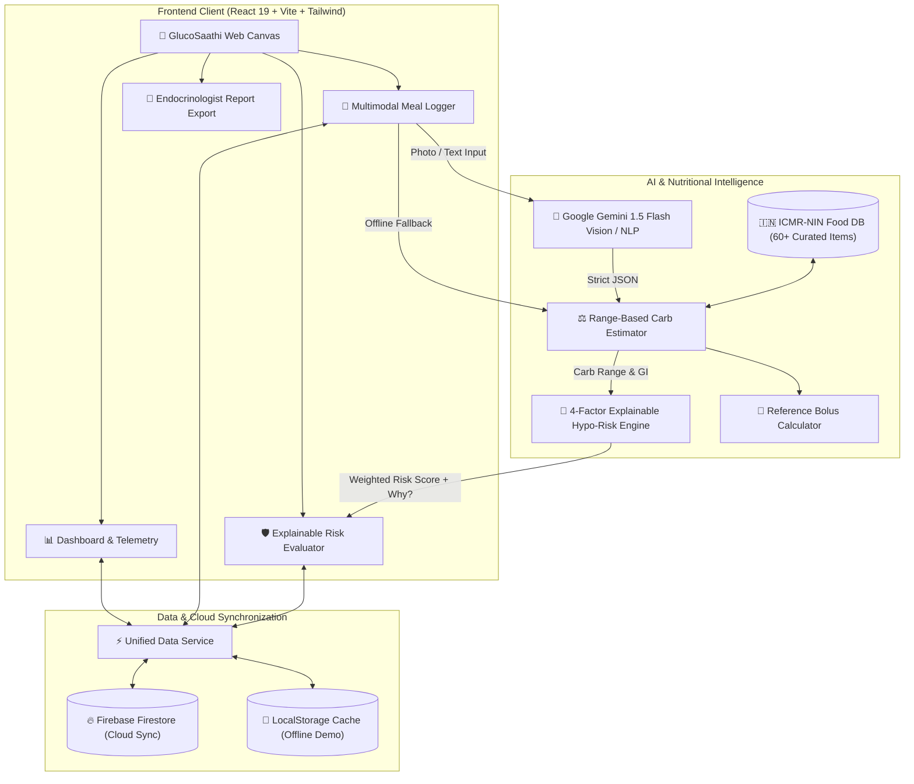

# 🩺 GlucoSaathi (ग्लूको-साथी)
### **AI-Powered Hypoglycemia Risk Prediction & Indian Meal Carb-Counting for Type 1 Diabetes**
> **Innovate 4 Impact: AI4SDG Global Hackathon 2026 — Problem Statement PS-102**  
> *Theme: Healthcare, Wellbeing & Accessibility (UN SDG 3: Good Health & Well-Being)*

---

## 🌟 The Crux of GlucoSaathi
Living with **Type 1 Diabetes (T1D)** in India forces patients and parents to make approximately **180 critical health decisions every single day**. The most perilous decision is calculating the insulin bolus needed for carbohydrate intake. 

- **A slight under-estimate** leads to severe hyperglycemia and diabetic ketoacidosis.
- **A slight over-estimate** triggers sudden, life-threatening **hypoglycemia (blood sugar $<70$ mg/dL)**, causing tremors, seizures, unconsciousness, or fatal brain damage during sleep or school.

Existing diabetes applications (BeatO, Fitterfly, MyFitnessPal) fail Indian T1D patients because:
1. **No Indian Carb Database**: Western databases recognize pizza and burgers, but fail at *dal-tadka*, *thepla*, *kanda poha*, *idli*, *dosa*, or *rajma-chawal*.
2. **Mixed Meal Culture**: Indian meals are composite thalis (*2 rotis + dal + rice + sabzi + curd*), making single-ingredient counting impractical.
3. **No Explainable Hypoglycemia Prediction**: Existing apps react after blood sugar drops rather than warning patients *before* an impending crash.

**GlucoSaathi bridges this critical divide** by combining an authoritative **ICMR-NIN calibrated Indian Food Database (60+ curated items)**, **Gemini 1.5 Flash Multimodal AI**, and an **Explainable Rule-Based Risk Engine** with transparent clinical reasoning and the **Clinical Rule of 15** emergency protocol.

---

## 👥 User Personas & Real-World Impact

```
     👧 Priya (12 yrs, School Student)           👨 Rajesh (45 yrs, Mixed Diet)          👩 Dr. Mehta (Endocrinologist)
     • Needs carb counts for school lunch         • Uses NPH + Regular insulin regimen    • Needs structured patient logs
     • Fears hypoglycemia during exams            • Eats traditional mixed Indian thalis  • Requires explainable risk factors
     • Uses parent's smartphone                   • Needs exercise-sensitive dose offsets • Exports 1-click clinical reports
```

---

## 🏗️ System Architecture



---

## ✨ Key Features & Clinical Capabilities

### 1. Curated ICMR-NIN Indian Food Carbohydrate Engine
- **Authoritative Data**: 60+ realistic Indian foods calibrated with **ICMR-NIN (National Institute of Nutrition, 2020)** standards.
- **Composite Meals**: Pre-configured combos (*Rajma Chawal*, *Dal Bhaat*, *Dosa Sambar*, *Idli Sambar*, *Pav Bhaji*).
- **Realistic Ranges**: Returns expected range (e.g. *68g, 60–75g range*) to respect home culinary variations.
- **Portion & Alias Support**: Automatically resolves regional names (`phulka`, `chapati` $\rightarrow$ `roti`; `chawal`, `bhaat` $\rightarrow$ `rice`; `dahi` $\rightarrow$ `curd`).

### 2. Gemini 1.5 Multimodal AI Meal Parser
- Accepts free natural language (*"2 rotis, 1 bowl dal tadka and steamed rice"*) or meal plate photos.
- Strict schema validation with **Zod** (`MealParseResponseSchema`).
- **Resilient Fallback**: Operates in full offline mode with built-in ICMR engine if API keys are not supplied.

### 3. Transparent, Explainable Hypoglycemia Risk Engine
- Predicts hypoglycemia risk using a weighted clinical model:
  $$\text{Score} = 0.40(\text{Active IOB}) + 0.30(\text{Carb Balance}) + 0.20(\text{Physical Activity}) + 0.10(\text{Meal Timing}) + \Delta_{\text{Glucose}}$$
- **Clinical Rule of 15 Emergency Protocol**: Immediately activates if glucose $< 70\text{ mg/dL}$ with clear fast-acting glucose instructions.
- **Explainable "Why?" Reasons**: Translates complex math into plain English (e.g., *"Elevated insulin on board (2.6 U) with intense exercise creates high hypo risk"*).

### 4. Reference Bolus Calculation Helper
- User-configurable **Insulin-to-Carb Ratio (ICR)**, **Target Glucose**, and **Correction Factor (ISF)**.
- Subtracts active IOB to prevent dangerous insulin stacking.
- Transparently labeled with non-prescriptive safety notices.

### 5. Endocrinologist Clinical Visit Summary & Export
- Generates clinical metrics: **Time-in-Range (TIR %)**, mean glucose, hypoglycemia exposure percentage, and average carbs per meal.
- 1-Click **Printable PDF Summary** and **CSV Dataset Export** for doctor consultations.

### 6. Built-in Demo Persona Switcher (For Hackathon Judges)
- **Aarav Sharma (24y)**: Active adult on basal-bolus regimen.
- **Priya Patel (12y)**: Pediatric T1D student needing safe school meal carb estimations.
- **Rajesh Kumar (45y)**: Traditional Indian diet using NPH + Regular insulin.

---

## 🛡️ Medical Safety Boundary & Disclaimer

> [!IMPORTANT]
> **GlucoSaathi is an educational and clinical decision-support prototype, NOT an autonomous medical device.**  
> - It does not autonomously prescribe or inject insulin.
> - All dose calculations are strictly for reference and must be confirmed with the patient’s physician-prescribed care plan.
> - Emergency hypoglycemia protocols adhere to standard pediatric and adult diabetes guidelines (ADA / RSSDI).

---

## 🛠️ Technical Stack

| Layer | Technology | Purpose |
| :--- | :--- | :--- |
| **Frontend** | React 19 + Vite + Tailwind CSS 4 | Ultra-fast, responsive light healthcare UI |
| **AI / Multimodal** | Google Gemini 1.5 Flash | Natural language & meal image plate recognition |
| **Nutritional Engine**| ICMR-NIN Food Composition Database | Indian carb, portion, and Glycemic Index database |
| **Validation** | Zod | Runtime validation for AI outputs & clinical logs |
| **Backend & Sync** | Firebase (Firestore, Auth, Storage) | Cloud synchronization with zero-config local fallback |
| **Testing** | Vitest | Unit tests for carb estimation and risk engine |

---

## 🚀 Quickstart & Local Setup

### 1. Clone & Install
```bash
git clone https://github.com/badgujarkunal93-blip/GlucoSaathi.git
cd GlucoSaathi
npm install
```

### 2. Configure Environment (Optional)
Copy `.env.example` to `.env`:
```bash
cp .env.example .env
```
*(Note: GlucoSaathi runs seamlessly out of the box in offline demo mode even without API keys!)*

### 3. Run Development Server
```bash
npm run dev
```
Open [http://localhost:5173](http://localhost:5173) in your browser.

### 4. Run Unit Tests
```bash
npx vitest run
```
*All 12 unit tests verify alias resolution, range-based carb calculations, hypoglycemia rule triggers, and Zod schema validations.*

---

## 🧪 Verified Test Results

```
✓ tests/riskEngine.test.js (4 tests)
✓ tests/carbEstimator.test.js (4 tests)
✓ tests/schemas.test.js (4 tests)

Test Files  3 passed (3)
     Tests  12 passed (12)
```

---

## 📄 License & Attribution
- **Dataset Attribution**: Nutritional composition derived from ICMR-National Institute of Nutrition (NIN) Indian Food Composition Tables (2020).
- **License**: MIT License. Developed for the **AI4SDG Global Hackathon 2026 (PS-102)**.
