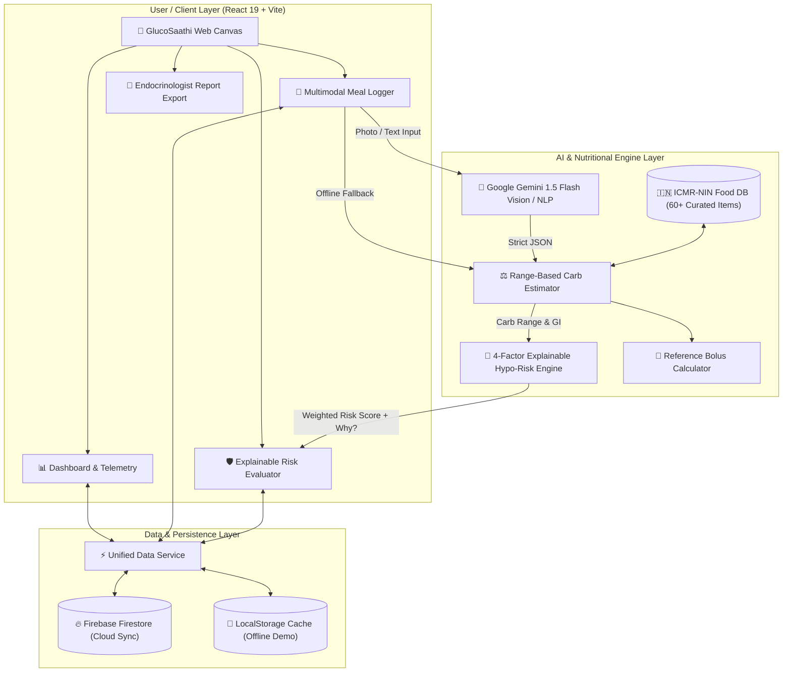

# 🏛️ GlucoSaathi Architecture & Technical Design

GlucoSaathi is an India-first clinical decision-support companion for Type 1 Diabetes (T1D) management, designed to prevent hypoglycemia and accurately calculate carbohydrate loads for mixed Indian diets.

---

## 1. High-Level Architecture Diagram

---

## 2. Core Architectural Subsystems

### A. Curated ICMR-NIN Indian Food Database
- **Location**: `src/data/indianFoods.json` & `src/lib/carb/carbEstimator.js`
- **Data Source**: Calibrated against **ICMR-NIN (National Institute of Nutrition, 2020)** food composition tables.
- **Coverage**: 60+ dishes spanning North, South, East, and West India, plus composite combo plates (*Rajma Chawal*, *Dal Chawal*, *Dosa Sambar*, *Idli Sambar*, *Pav Bhaji*).
- **Features**: Multi-lingual alias resolution (e.g. `phulka`, `chapati` $\rightarrow$ `roti`; `dahi` $\rightarrow$ `curd`), portion units (*katori*, *piece*, *plate*, *glass*), Glycemic Index tags, and carbohydrate ranges ($\pm 10\text{--}20\%$).

---

### B. Multimodal AI Meal Parser
- **Location**: `src/lib/ai/mealParser.js`
- **Model**: Google Gemini 1.5 Flash (Vision & Natural Language Understanding).
- **Validation**: Strict schema enforcement using **Zod** (`MealParseResponseSchema`).
- **Resilience**: Zero-crash graceful fallback to the local deterministic ICMR engine when offline or if an API key is not configured.

---

### C. Explainable Hypoglycemia Risk Engine
- **Location**: `src/lib/risk/riskEngine.js` & `src/lib/risk/riskConfig.js`
- **Formula**:
  $$\text{Score} = 0.40(\text{IOB}) + 0.30(\text{Carb Balance}) + 0.20(\text{Activity}) + 0.10(\text{Meal Timing}) + \Delta_{\text{Glucose}}$$
- **Clinical Emergency Boundary**: Triggers the **Clinical Rule of 15** emergency protocol if glucose drops $<70\text{ mg/dL}$.
- **Transparency**: Provides non-technical plain-language "Why?" explanations for every risk level.

---

### D. Reference Bolus Calculation Helper
- **Location**: `src/lib/risk/riskEngine.js`
- **Parameters**:
  $$\text{Suggested Dose} = \frac{\text{Carbohydrates}}{\text{ICR}} + \frac{\text{Glucose} - \text{Target}}{\text{ISF}} - (\text{Active IOB} \times 0.5)$$
- **Medical Disclaimer**: Clear non-prescriptive labeling (*"Reference estimate only — confirm with your prescribed care plan"*).

---

### E. Clinical Visit Summary & Export
- **Location**: `src/components/DoctorReportModal.jsx`
- **Features**: Generates Time-in-Range (TIR %), mean glucose, hypo exposure percentage, and 1-click CSV and printable PDF summaries for endocrinologists.
