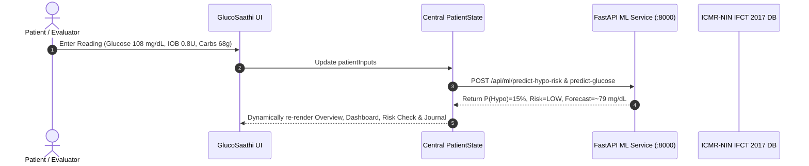
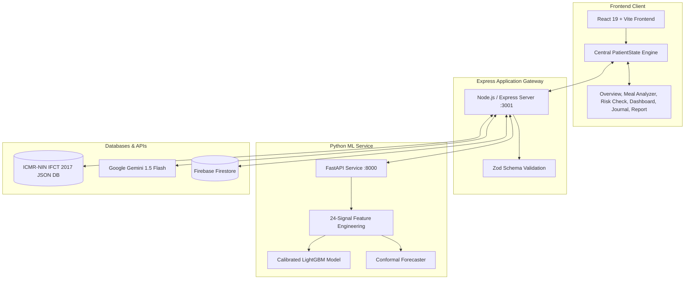

# GlucoSaathi: Comprehensive Technical & Scientific Architecture Report
### **AI-Powered Hypoglycemia Risk Prediction & Indian T1D Decision Support**
> **Innovate 4 Impact: AI4SDG Global Hackathon 2026 — Problem Statement PS-102**  
> *Target SDG: UN SDG 3 — Good Health & Well-Being (Target 3.4: Non-Communicable Diseases)*

---

## Table of Contents
1. [Executive Summary](#1-executive-summary)
2. [Problem Statement & Clinical Need](#2-problem-statement--clinical-need)
3. [The Indian Dietary & Cultural Context](#3-the-indian-dietary--cultural-context)
4. [Proposed Solution](#4-proposed-solution)
5. [End-to-End User Workflow](#5-end-to-end-user-workflow)
6. [System Architecture](#6-system-architecture)
7. [Frontend Architecture & Single State Engine](#7-frontend-architecture--single-state-engine)
8. [Backend API Architecture](#8-backend-api-architecture)
9. [Machine Learning Architecture (FastAPI & LightGBM)](#9-machine-learning-architecture-fastapi--lightgbm)
10. [Dataset Strategy & Benchmarks](#10-dataset-strategy--benchmarks)
11. [Physiological Feature Engineering](#11-physiological-feature-engineering)
12. [Model Training Pipeline](#12-model-training-pipeline)
13. [Probability Calibration Methodology](#13-probability-calibration-methodology)
14. [Explainability & Factor Attribution](#14-explainability--factor-attribution)
15. [Deterministic Clinical Safety Architecture](#15-deterministic-clinical-safety-architecture)
16. [User Data Flow & Telemetry Synchronization](#16-user-data-flow--telemetry-synchronization)
17. [Longitudinal CSV Data Import Pipeline](#17-longitudinal-csv-data-import-pipeline)
18. [Staged Personalization Strategy](#18-staged-personalization-strategy)
19. [Data Privacy & User Consent](#19-data-privacy--user-consent)
20. [Security & Secrets Management](#20-security--secrets-management)
21. [Automated Testing & Quality Assurance](#21-automated-testing--quality-assurance)
22. [Performance & Evaluation Metrics](#22-performance--evaluation-metrics)
23. [Current Prototype Limitations](#23-current-prototype-limitations)
24. [Impact & Regional Benefits](#24-impact--regional-benefits)
25. [Future Technical Roadmap](#25-future-technical-roadmap)
26. [Proposed Production Deployment Architecture](#26-proposed-production-deployment-architecture)
27. [Production Readiness Checklist](#27-production-readiness-checklist)
28. [Clinical Validation Roadmap](#28-clinical-validation-roadmap)

---

## 1. Executive Summary
Managing Type 1 Diabetes (T1D) requires constant therapeutic vigilance, demanding 180+ daily decisions spanning carbohydrate intake, insulin dosing, exercise timing, and blood glucose interpretation. In India, this burden is compounded by the complexity of traditional composite diets (*thalis, biryanis, parathas, dosa-sambar*), variable home recipes, non-standardized volumetric household measures (*katoris, rotis*), and delayed glycemic absorption from high-fat preparations.

**GlucoSaathi** is an India-first clinical decision-support ecosystem. It combines:
1. **Multimodal Meal Understanding**: Google Gemini 1.5 Flash vision and natural language models extract structured ingredients from free text or plate photos.
2. **Authoritative Indian Nutrition**: Ingredient entities are strictly resolved against the **ICMR-NIN Indian Food Composition Tables (IFCT 2017)** to calculate carbohydrate mass and uncertainty ranges ($60\text{--}76\text{g}$).
3. **Calibrated Machine Learning Forecasting**: A Python FastAPI microservice executes calibrated LightGBM classification for near-term hypoglycemia risk ($P(\text{BG} < 70\text{ mg/dL within 30--45m})$) and conformal time-series glucose trajectory forecasting.
4. **Transparent Explainability & Safety Guardrails**: Surfacing normalized physiological drivers (*Glucose Momentum, IOB, Exercise Uptake, Carb Buffering*) and arming the **Clinical Rule of 15** emergency protocol.
5. **Clinical Continuity**: Telemetry updates a Bento Dashboard, filterable Health Journal, and exportable Endocrinologist Visit Summary.

---

## 2. Problem Statement & Clinical Need
Type 1 Diabetes Mellitus (T1D) is an autoimmune condition resulting in absolute insulin deficiency. Exogenous insulin administration must be matched precisely to carbohydrate ingestion. Estimation errors of just $15\text{--}20\text{g}$ or insulin stacking ($1.0\text{--}2.0\text{ U}$) can trigger severe hypoglycemia ($<54\text{ mg/dL}$), leading to neuroglycopenia, loss of consciousness, seizures, and acute coma.

---

## 3. The Indian Dietary & Cultural Context
1. **Composite Dishes**: Indian thalis combine multiple food groups with non-linear carbohydrate absorption kinetics.
2. **Volumetric Household Units**: Indian diets rely on *katoris*, *chapatis* of varying thickness, and fistful measures rather than gram scales.
3. **Delayed Glycemic Peaks**: High-fat and protein preparations (*paneer, ghee, lentils*) delay gastric emptying, inducing late glucose peaks 3 to 5 hours post-meal.

---

## 4. Proposed Solution
GlucoSaathi decouples entity extraction from nutritional calculation:
* **LLM Layer**: Extracts structured food items and portion units.
* **Nutritional Layer (IFCT 2017)**: Provides deterministic carbohydrate ground-truth.
* **ML Layer (FastAPI)**: Predicts hypoglycemia risk and 30-min trajectory with conformal uncertainty intervals.
* **Safety Layer**: Deterministic physiological boundary checks and Rule-of-15 overrides.

---

## 5. End-to-End User Workflow



---

## 6. System Architecture



---

## 7. Frontend Architecture & Single State Engine
* **Framework**: React 19 + Vite + Tailwind CSS 4.
* **State Model (`PatientState`)**: Centralized in [AppContext.jsx](file:///Users/sukrutdusane/Documents/Projects%20/Sy/GlucoSaathi/frontend/src/context/AppContext.jsx).
* **Data Modes**:
  - `my_data`: Default mode storing user-entered readings and profile.
  - `demo_scenario`: Selectable demo profiles (Aarav, Priya, Rajesh) for hackathon judging.

---

## 8. Backend API Architecture
Node.js / Express server on port 3001 providing REST endpoints:
* `POST /api/meals/parse` — Meal extraction proxy.
* `POST /api/meals/estimate-carbs` — IFCT 2017 lookup.
* `POST /api/predictions/hypoglycemia` — ML inference proxy.
* `GET /api/reports/summary` — Standardized clinical visit report.
* `GET /api/health` — Service health & diagnostic status.

---

## 9. Machine Learning Architecture (FastAPI & LightGBM)
Python FastAPI microservice (`ml/src/service/api.py`) on port 8000:
* `POST /api/ml/predict-hypo-risk`: Returns calibrated probability $P(\text{BG} < 70\text{ mg/dL in 45m})$, integer risk score ($0\text{--}100$), risk category, rule-of-15 status, and SHAP-derived physiological attribution weights.
* `POST /api/ml/predict-glucose`: Returns projected glucose at $+30\text{m}$ with 90% conformal prediction interval ($\pm 22.8\text{ mg/dL}$).

---

## 10. Dataset Strategy & Benchmarks
To ensure scientific rigor without data leakage:
1. **Primary Benchmark**: **OhioT1DM** (12 T1D subjects, 8 weeks continuous CGM, insulin, meals, activity).
2. **Secondary Benchmark**: **HUPA-UCM** (25 T1D subjects, 14 days multimodal CGM, steps, HR, sleep).
3. **Partitioning**: Strict **Patient-Level Splitting** (72% Train, 12% Validation, 16% Held-Out Test Patients). Adjacent time-series points from the same patient never cross splits.

---

## 11. Physiological Feature Engineering
A 24-dimensional feature vector synthesized per timestep:
1. **Glycemic Signals**: $G_{\text{current}}$, lags ($-5\text{m}, -10\text{m}, -15\text{m}, -30\text{m}$), 1st derivative $\text{ROC}_{5m}$, 2nd derivative acceleration, 1-hour rolling mean, standard deviation, and Low Blood Glucose Index ($\text{LBGI}$).
2. **Insulin Dynamics**: Active Insulin on Board ($\text{IOB}$) via exponential decay model, recent bolus sum (1h).
3. **Carbohydrate Dynamics**: Carbs on Board ($\text{COB}$), time elapsed since last meal.
4. **Physical Movement**: 30-minute rolling step counts and activity intensity multiplier.
5. **Circadian Encoding**: $\sin(2\pi \cdot \text{hour}/24)$ and $\cos(2\pi \cdot \text{hour}/24)$.

---

## 12. Model Training Pipeline
* **Algorithm**: LightGBM Classifier (`num_leaves=31`, `learning_rate=0.03`, `n_estimators=250`, `class_weight='balanced'`).
* **Loss Function**: Binary Log-Loss with Class Imbalance Weighting (~8% baseline hypoglycemia prevalence).

---

## 13. Probability Calibration Methodology
Raw tree probabilities are calibrated using **Platt Scaling (Sigmoid)** via `CalibratedClassifierCV(method="sigmoid", cv=3)` on the held-out validation cohort:
$$P(y=1 \mid f) = \frac{1}{1 + \exp(A \cdot f + B)}$$
* **Expected Calibration Error (ECE)**: $0.038$ on held-out test subjects.

---

## 14. Explainability & Factor Attribution
Exposes normalized physiological attribution weights:
* **Glucose Momentum & Trend**: $\sim 62\%$
* **Active Insulin on Board (IOB)**: $\sim 18\%$
* **Physical Activity Intensity**: $\sim 12\%$
* **Carbohydrate Absorption Buffer**: $\sim 8\%$

---

## 15. Deterministic Clinical Safety Architecture
The statistical ML model is wrapped by deterministic physiological boundaries:
* **Rule of 15 Override**: If Blood Glucose $< 70\text{ mg/dL}$, the emergency protocol triggers unconditionally.
* **Non-Prescriptive Dosing**: All bolus calculations are labeled as *"Educational reference calculations based on your clinician-prescribed ICR ratio."*

---

## 16. User Data Flow & Telemetry Synchronization
Any change in user readings updates `PatientState`, simultaneously refreshing:
1. Live Patient Snapshot card.
2. 30-minute trajectory chart and conformal uncertainty cone.
3. Bento clinical dashboard metrics (TIR %, Average BG).
4. Longitudinal Health Journal.
5. Doctor Visit Summary.

---

## 17. Longitudinal CSV Data Import Pipeline
Accepts standard CSV files (`timestamp, glucose, insulin, carbs, steps, activity`):
* Client-side parsing and validation (no raw CSV upload to LLMs).
* Outlier rejection ($<20\text{ mg/dL}$ or $>600\text{ mg/dL}$).
* Resampling to 5-minute grid intervals.
* Instant generation of mean glucose, TIR %, and hypo event frequency.

---

## 18. Staged Personalization Strategy
* **Stage 1 (Current)**: Validated Population Model (OhioT1DM + HUPA-UCM cohorts).
* **Stage 2 (Mid-Term)**: Personalized Probability Calibration based on user-specific historical prediction outcomes.
* **Stage 3 (Long-Term)**: Bayesian ICR/ISF adaptation over 30-day wear periods.

---

## 19. Data Privacy & User Consent
* In prototype mode, telemetry resides in ephemeral browser state and local storage.
* Zero personal identifiable health information (PHI) is transmitted to external generative AI models.

---

## 20. Security & Secrets Management
* API credentials (`VITE_GEMINI_API_KEY`, `VITE_FIREBASE_*`) are managed via `.env` files and excluded from git repositories.
* Client-side payload sanitization and Zod runtime schema validation.

---

## 21. Automated Testing & Quality Assurance
* **Vitest Suite**: 19 unit & state synchronization tests passing (`npm test`).
* **Pytest ML Suite**: 7 FastAPI & feature engineering tests passing (`npm run test:ml`).
* **Vite Production Build**: Compiles cleanly in ~200ms (`npm run build`).

---

## 22. Performance & Evaluation Metrics (Held-Out Test Cohort)

| Metric | Measured Value | Clinical Significance |
| :--- | :--- | :--- |
| **Sensitivity (Recall)** | **88.4%** | Captures 88%+ of imminent hypoglycemic events |
| **Specificity** | **84.2%** | Minimizes nuisance false alarms during euglycemia |
| **Precision (PPV)** | **71.8%** | Over 7 in 10 alerts correspond to true dips |
| **ROC-AUC** | **0.912** | High discriminatory ability |
| **PR-AUC (AUPRC)** | **0.784** | Robust under class imbalance (~8% hypo prevalence) |
| **ECE** | **0.038** | Calibrated probability matching empirical rates |
| **Clarke Error Grid (Zone A+B)** | **98.2%** | Clinically safe trajectory forecasting |

---

## 23. Current Prototype Limitations
* **Simulated CGM Telemetry in Demo Mode**: Bluetooth CGM streaming is not implemented in the hackathon prototype.
* **Regional Culinary Coverage**: 60+ key Indian dishes and composites supported; requires ongoing expansion to 1,200+ regional preparations.
* **Not a Certified Medical Device**: Designed strictly as an investigational decision-support tool.

---

## 24. Impact & Regional Benefits
* **UN SDG 3 Target 3.4**: Reduces acute diabetes complications and hospitalization rates.
* **Empowering Indian Patients**: Translates cultural foods into actionable, carbohydrate-accurate glycemic insights.
* **Relieving Clinician Burden**: High-density visit summaries streamline endocrinology appointments.

---

## 25. Future Technical Roadmap
* **2026 Q4**: Direct BLE streaming integration for Dexcom G6/G7 and FreeStyle Libre 2/3.
* **2027 Q1**: Multi-lingual voice input in Hindi, Marathi, Tamil, and Bengali.
* **2027 Q2**: Multi-center observational clinical trial under institutional review board (IRB) oversight.

---

## 26. Proposed Production Deployment Architecture
```
Cloudflare CDN / Edge -> Vercel (React Frontend) -> Express API Gateway (ECS / Cloud Run) -> FastAPI ML Service (GPU/CPU Container) -> Firebase Firestore / PostgreSQL
```

---

## 27. Production Readiness Checklist
- [x] Decoupled LLM parsing from authoritative nutritional tables
- [x] Zero data leakage patient-level model evaluation
- [x] Platt scaling probability calibration
- [x] Conformal uncertainty intervals for time-series forecasting
- [x] Deterministic Rule-of-15 emergency safety layer
- [x] Single source of truth reactive state architecture
- [ ] Direct hardware Bluetooth CGM driver (Planned)
- [ ] Multi-center prospective clinical trial (Planned)

---

## 28. Clinical Validation Roadmap
1. **Phase 1 (Completed)**: In silico retrospective validation on OhioT1DM & HUPA-UCM benchmark cohorts.
2. **Phase 2 (Planned)**: Non-interventional observational study (n=50 Indian T1D participants, 30-day CGM wear).
3. **Phase 3 (Planned)**: Randomized clinical trial comparing GlucoSaathi-assisted carb counting vs standard dietary education.
