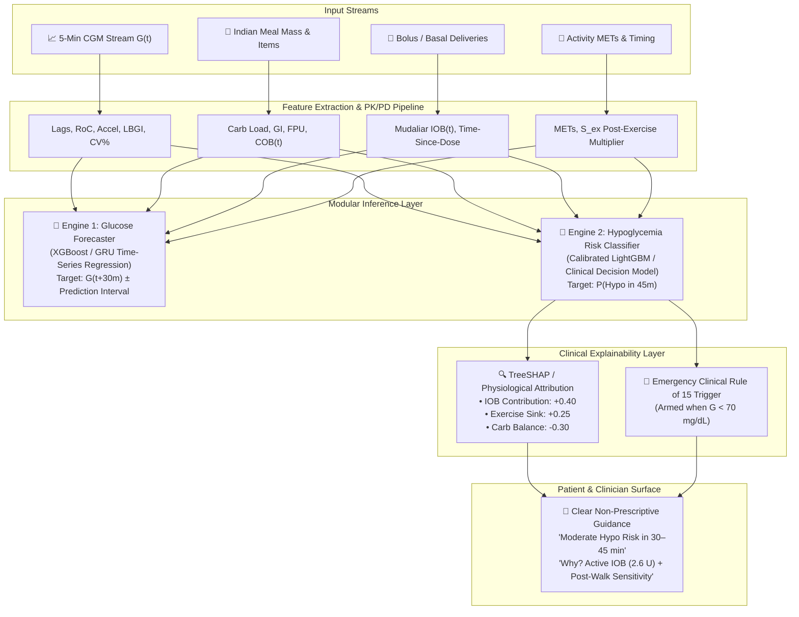

# 🏗️ Model Architecture & Machine Learning Strategy
### **GlucoSaathi — Multi-Model System Design & Leakage Prevention**

---

## 1. Machine Learning Model Architecture Comparison

We evaluate time-series architectures across clinical interpretability, computational complexity, data efficiency, and suitability for outpatient glucose decision support:

| Model Family | Architecture | Input Requirements | Clinical Interpretability | Computational Cost | Data Requirements | Suitability for GlucoSaathi |
| :--- | :--- | :--- | :--- | :--- | :--- | :--- |
| **Baseline 1: Persistence** | Naive rule: $\hat{G}(t+h) = G(t)$ | Current $G(t)$ only | 100% Transparent | $\mathcal{O}(1)$ (Zero train) | None | **Mandatory Baseline** for $h \le 15\text{ min}$. |
| **Baseline 2: Linear / Ridge** | Autoregressive + Lags | Flattened lag vector | High (Linear coefficients) | Very Low (CPU) | Small ($10^2$ samples) | **Benchmark** for feature significance. |
| **Gradient Boosted Trees (XGBoost / LightGBM)** | Tree ensembles with gradient boosting | Tabular engineered lag & rolling features | High (Exact TreeSHAP attribution) | Low (Fast inference $<5\text{ms}$) | Medium ($10^3\text{--}10^5$ samples) | **TIER 1 PREFERRED** for tabular outpatient prediction. |
| **Recurrent Networks (LSTM / GRU)** | Gated sequential memory cells | 3D tensor: $[B, T, F]$ sequence | Moderate (Integrated Gradients) | Moderate (GPU train, CPU infer) | High ($10^4\text{--}10^6$ samples) | **TIER 1** for continuous 5-min dense CGM streams. |
| **Temporal CNN (TCN)** | Dilated causal 1D convolutions | 3D sequence tensor | Moderate (Saliency maps) | Low–Moderate (Parallel training) | High ($10^4\text{--}10^6$ samples) | **Strong Alternative** to LSTM with larger receptive field. |
| **Temporal Fusion Transformer (TFT)** | Multi-head self-attention + gating + static covariates | Multi-horizon sequences + patient metadata | High (Attention weights + variable selection) | High (Requires GPU cluster for training) | Very High ($>10^5$ multi-patient series) | **Future Research Target** for multi-center cohorts. |

---

## 2. Modular Multi-Engine System Architecture



---

## 3. Train / Validation / Test Splitting Strategy & Data Leakage Prevention

Time-series clinical data is susceptible to subtle, catastrophic data leakage if standard random k-fold cross-validation is applied.

```
PATIENT-LEVEL STRATIFIED SPLIT (Zero Subject Overlap):
┌────────────────────────────────────────────────────────────────────────────────────────┐
│ TRAINING COHORT (70% of Patients, e.g. OhioT1DM Patients 559, 563, 570, 575, 588, 591) │
│ • Forward Chaining Time Split: Train [Day 1 → Day 35] ──► Val [Day 36 → Day 45]       │
├────────────────────────────────────────────────────────────────────────────────────────┤
│ INDEPENDENT TEST COHORT (30% of Patients, e.g. OhioT1DM Patients 540, 544, 552, 567)  │
│ • Held completely unseen until final model evaluation                                  │
└────────────────────────────────────────────────────────────────────────────────────────┘
```

### **Strict Anti-Leakage Rules**
1. **No Inter-Subject Leakage (Patient-Level Separation)**:
   * Models are tested on completely unseen subjects whose data was never present during feature normalization or model training. This measures true **population generalizability**.
2. **Chronological Forward-Chaining (No Future-to-Past Leakage)**:
   * Within individual subject fine-tuning, training strictly precedes validation in time ($t_{\text{train}} < t_{\text{val}} < t_{\text{test}}$).
3. **Out-of-Fold Preprocessing Parameters**:
   * Min-max scalers, standardizers, and imputation medians are fitted exclusively on the training set and applied downstream to validation/test sets without re-fitting.
